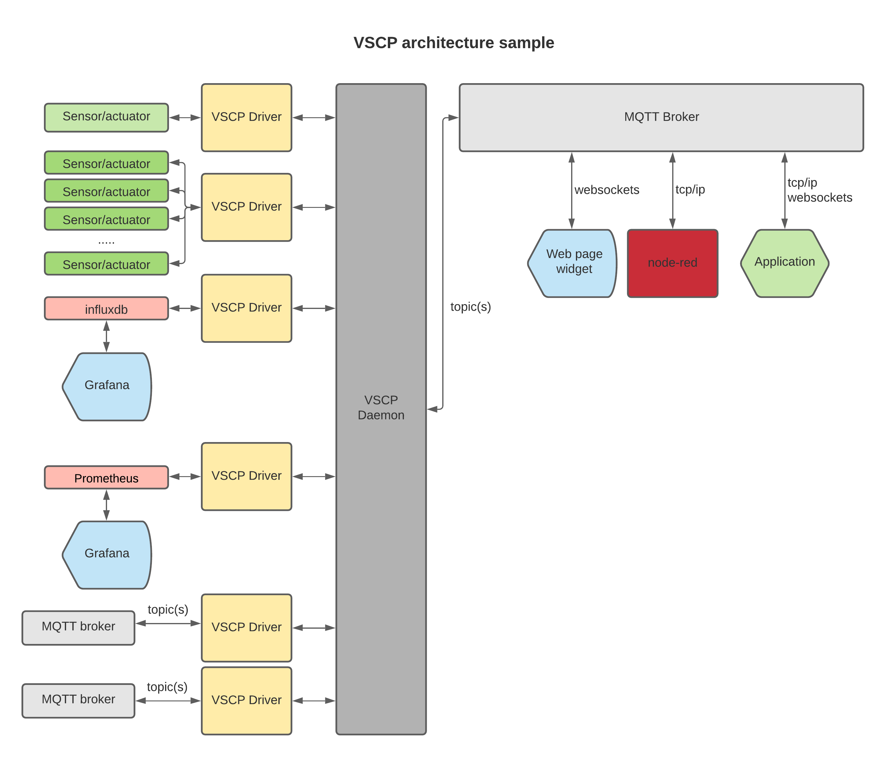

<h1>VSCP & Friends</h1>


[](https://github.com/grodansparadis/vscp/releases)
[](https://travis-ci.org/grodansparadis/vscp)
[](https://www.repostatus.org/#active)


*You can look at device for device and create control software for each and one of them, we did it another way, we though of a black box device and created control software that works with everything that exists. __One to unite them all__.*


<p>VSCP (Very Simple Control Protocol) is a framework for IoT/m2m tasks. The framework defines methods to
have a common device discovery, a common configuration, a common way to interface with remote devices and a
common way to update firmware of devices built on different architectures. A server is available that runs on
many platforms that have a webserver/websocket/rest/driver and tcp/ip interface with ssl security.



Documentation for VSCP is available at [https://docs.vscp.org](https://docs.vscp.org)

Checkout with 

```bash
git clone -j8 https://github.com/grodansparadis/vscp.git
```

<p>A short introduction to VSCP is available
<a href="https://www.slideshare.net/keHedman/2014-01-33087344">here</a> and
<a href="https://www.slideshare.net/keHedman/vscp-presentation-eindhoven">here</a>.</p>
</p>

<p>
Documentation in different formats <a href="https://docs.vscp.org/">is available here</a>.
</p>

<p>
Also there is a <a href="https://github.com/grodansparadis/vscp_firmware"firmware repository</a> with many examples for different platforms and a
<a href="https://github.com/grodansparadis/vscp_html5">HTML5 websocket UI repository</a>.
</p>


Copyright (C) 2000-2024 Ake Hedman, the VSCP project - MIT license.

