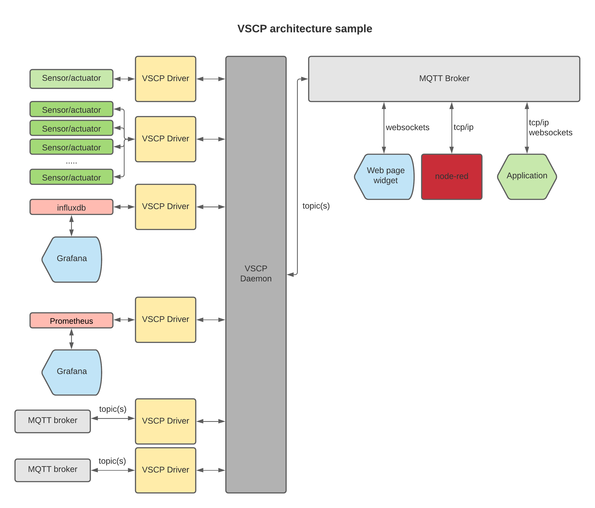

<h1>VSCP & Friends</h1>


[](https://github.com/grodansparadis/vscp/releases)
[](https://travis-ci.org/grodansparadis/vscp)
[](https://www.repostatus.org/#active)


*You can look at device for device and create control software for each and one of them, we did it another way, we though of a black box device and created control software that works with everything that exists. __One to unite them all__.*


<p>VSCP (Very Simple Control Protocol) is a framework for IoT/m2m tasks. The framework defines methods to
have a common device discovery, a common configuration, a common way to interface with remote devices and a
common way to update firmware of devices built on different architectures. A server is available that runs on
many platforms that have a webserver/websocket/rest/driver and tcp/ip interface with ssl security.



Documentation for VSCP is available at [https://docs.vscp.org](https://docs.vscp.org)

Checkout with 

```bash
git clone -j4 --recurse-submodules https://github.com/grodansparadis/vscp.git
```

<p>A short introduction to VSCP is available
<a href="https://www.slideshare.net/keHedman/2014-01-33087344">here</a> and
<a href="https://www.slideshare.net/keHedman/vscp-presentation-eindhoven">here</a>.</p>
</p>

<p>
Documentation in different formats <a href="https://docs.vscp.org/">is available here</a>.
</p>

<p>
Also there is a <a href="https://github.com/grodansparadis/vscp_firmware"firmware repository</a> with many examples for different platforms and a
<a href="https://github.com/grodansparadis/vscp_html5">HTML5 websocket UI repository</a>.
</p>

## License

The whole source code is published under the MIT license. Consider the different licenses of possible third party libraries too!

## Contribution

Unless you explicitly state otherwise, any contribution intentionally submitted for inclusion in the work by you, shall be licensed as above, without any additional terms or conditions.


## Thanks
First a big thanks to my [sponsors](https://github.com/sponsors/grodansparadis) and [here](https://vscp.org). Support them please. Every cent is valuable and there support has helped me and the project a lot.

The a big thank you to the following project that this code is built upon

* The excellent [nlohmann json parser](https://github.com/nlohmann/json)
* The excellent [libexpat xml library](https://github.com/libexpat/libexpat)
* The excellent [mosquitto library](https://github.com/eclipse/mosquitto)
* The excellent [spdlog library](https://github.com/gabime/spdlog)
* The excellent [civetweb project](https://github.com/civetweb/civetweb)
* The excellent [mustache library](https://github.com/janl/mustache.js)
* And all other code I used to build this on.

_Great things are built on the shoulders of giants. Thank you!_

Copyright (C) 2000-2026 Ake Hedman, the VSCP project - MIT license.

