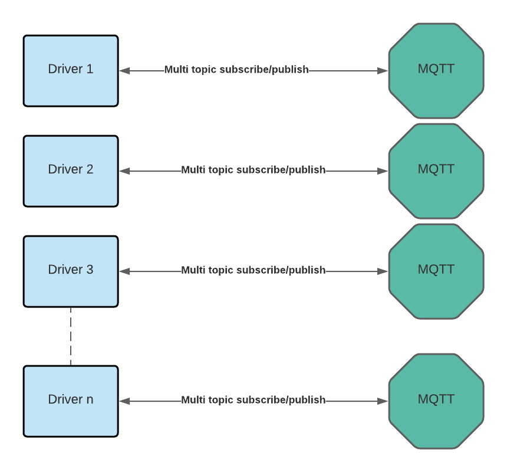

# VSCP Daemon Driver Interfaces

The VSCP daemon recognize two types of drivers. **Level I drivers** that confirm to the CANAL interface specification and initially was called CANAL drivers and **Level II drivers** that use the higher end VSCP package format and the  full GUID for node and interface identification.

* [Level I Drivers](./level_i_drivers.md)
* [Level II Drivers](./level_ii_drivers.md)

## Driver overview

IN the previous version (14.0) of the VSCP daemon the server worked as a hub connecting all drivers and users interfaces (connections) together. form version 15.0 this taskhas been left to a MQTT broker to perform. 

In the picture above you see how each driver connects to a MQTT broker. Each of them can connect to its own broker, with it's own settings and it's own credentials or all of them can connext to the same MQTT broker. This is all up to the user to set up.

A driver can subscribe to any number of topics from the MQTT broker.

A driver can publish VSCP event payloads to any number of MQTT topics on json, xml, string or binary form.

For all this the VSCP daemon just act as a proxy gluing it all together.

This image shows the overall workings

So for example a low end node on the level I interface that post a temperature wil send it to the level i driver for the transport medium it sits on (CAN, RS-485, LoRa, a single hardware sensor, etc) and the driver will pass this event on to the VSCP daemon which will publish it as VSCP events to the configured topic(s) on the selected formats.

The VSCP daemon on the behalf of the level I driver then subscribe to a configurable set of topics and will send the events received from them to driver which in turn will send them to the node.

When the VSCP event has reached the MQTT broker it can be feed to a web components such as a temperature gauge  over websocket or sent over a bridge to another MQTT broker.

## Build a HUB

To get the HUB functionality of the old VSCP daemon version one just publish to the same topic and also read from a common topic.

[filename](./bottom_copyright.md ':include')