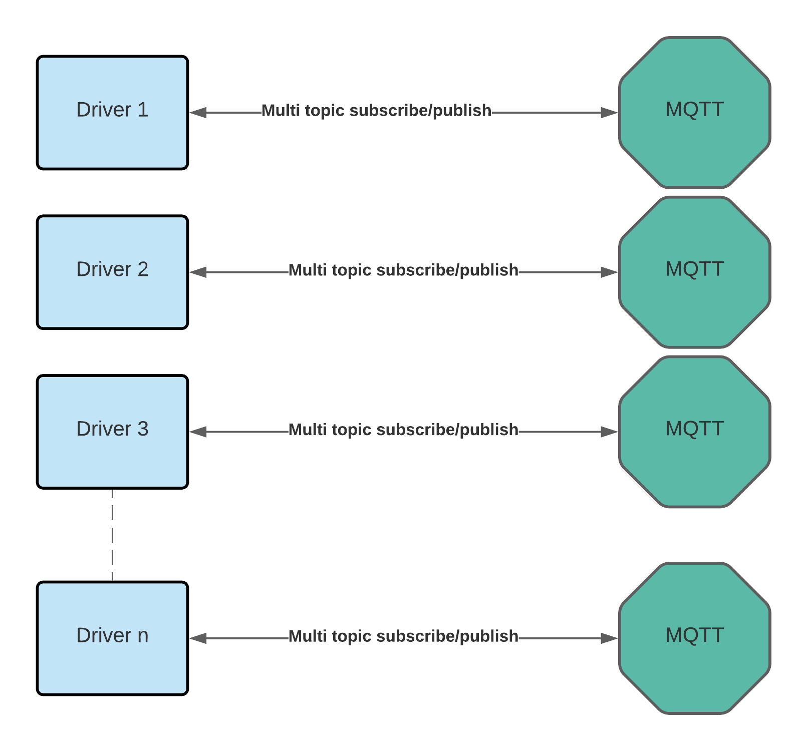

# Introduction to the VSCP Daemon Software

The VSCP daemon is an interface software that sits between low level devices and the higher end device world. It can also connect to other VSCP servers and hardware nodes forming large and complex systems. The low end devices may be VSCP enabled or other types of devices thant know nothing about VSCP. The driver system of VSCP serve as a hardware abstraction layer that makes it possible to connect to anything that is out there. 

Two sorts of drivers are available, **Level I** and **Level II**, with slightly different capabilities. It is easy to construct new drivers and there are plenty of sample code on how to do so available.

From version 15.0 The VSCP daemon work tightly together with a local or remote MQTT broker. It can be looked on as a low lever interface for the MQTT and higher end world. 

Functionality that previously was incorporated in the VSCP daemon is now available as drivers. So now the built in web-server with websocket interfaces etc is instead a driver. Also the tcp/ip interface is available as a driver.

## Overview

In the picture above a setup is shown from VSCP's point of view. The VSCP daemon is shown subscribing/publishing to a specific MQTT broker. In reality this can be several MQTT brokers and one or several arbitrary subscriptions/publishing topics to each.

A bridge to another MQTT broker that connects two of them together is also shown. Bridging is a good way to secure data into specific physical/logical domains. There can also be any number of bridges.

Now imagine a low end node connected to the level I interface of the VSCP daemon. If it delivers a temperature event this event can pass through the VSCP daemon and get published to the MQTT broker. A widget on an internal web page widget can subscribe to events of this type and show the current temperature in it's presentation interface.

The other way around is when a web widget user push a button and a VSCP event is sent over websocket to the broker and the topic it is sent over is subscribed to by a level II driver which light up a Bluetooth lamp in the bedroom when it detects the event.

Note that the abstraction of a temperature and a button pressed is preserved all the way from the user interface to the low level driver. Its is thus very easy to replace the Bluetooth lamp with for example a Zigbee lamp.

Only websocket connection is shown to the MQTT broker but of course higher level clients can subscribe/publish from/to it at whish. The Bluetooth/Zigbee lamp could be connected here equally well as behind the VSCP daemon and a driver. Where a node fits best depends on the the setup and what one think is best.

## Drivers

Both level I drivers and level II drivers each define a separate connection to a MQTT broker. Each can subscribe to VSCP events from any number of topics and publish VSCP events to any number of topics. It is thus easy to set up systems that work as a event hub and at the same time log and debug data and possibly do many other things with events.

## Why the new setup?

MQTT have so much code and infrastructure in place that it is impossible to ignore. It would also be very stupid not to use the good things that are available. Better to work together and reuse work of others efforts.

MQTT is not a IoT protocol even if many wrongly state that it is. It is however a IoT **transport** protocol. A job it does very well. 

VSCP on the other hand is a IoT protocol. Yes even a framework with all tools available. The combination MQTT + VSCP is just good match.  By combining them a lot of work can be reused. Important for a small project like VSCP. 

Take for example the VSCP tcp/ip interface. It does it's job well and is still (abd will be) valid for many VSCP devices. But MQTT can do the same thing also in a nice way. Adding security and tools and a lot more.

Another example is the VSCP [websockets ws1 and ws2 protocols](https://grodansparadis.github.io/vscp-doc-spec/#/./vscp_websocket). Both are constructed mainly as interfaces between sensors and user interface components that needs to be kept updated. MQTT also have a websocket interface defined and it can in a nice way do the same job as the VSCP variants.

Also there is now a focus on the lower end of things in the VSCP development. Others projects do higher level stuff better. [Node-red](https://nodered.org/) for example is a good project for this such of things and there are plenty of others. For node-red there are two VSCP tools available. Checkout [node-red-contrib-vscp](https://flows.nodered.org/node/node-red-contrib-vscp) and [node-red-contrib-vscp-tcp](https://flows.nodered.org/node/node-red-contrib-vscp-tcp).

## Removed functionality in the new version of the VSCP daemon

Not only was all code rewritten to use standard c++ in the transition from version 14.0 to 15.0 a lot of functionality was also removed. 

A lot of the old functionality has been moved to installable drivers instead.

## tcp/ip interface
In the 14.0 version of VSCP daemon the tcp/ip interface was a central piece. If you still need it, install the driver [vscpl2drv-tcpipsrv](https://github.com/grodansparadis/vscpl2drv-tcpipsrv).

If you want to connect to another device with a VSCP tcp/ip interface you can use the driver [vscpl2drv-tcpiplink](https://github.com/grodansparadis/vscpl2drv-tcpiplink). This makes it possible to connect the new VSCP daemon to a machine with 14.0 installed or a more lower end ethernet node with the tcp/ip interface exported.

## Web-server, websockets, REST
In the 14.0 version of VSCP daemon a webserver with server side LUA and javascript support and with websocket (ws1 and ws2) and a REST interface was available. Well there was a lot more also. If you miss this donät despair. The functionality is now available as a driver. Go to the [vscpl2drv-websrv](https://github.com/grodansparadis/vscpl2drv-websrv) repository for more info on how to install and use.

## Decision Matrix
Has been removed. Use [node-red](https://nodered.org/) instead. There may be a driver with this functionality available in the future. Check out [vscpl2drv-dm](https://github.com/grodansparadis/vscpl2drv-dm) or better yet help out to build the functionality.

## Tables
Has been removed. Use [node-red](https://nodered.org/) instead. There may be a driver with this functionality available in the future. Check out [vscpl2drv-table](https://github.com/grodansparadis/vscpl2drv-table) or better yet help out to build the functionality.

## Remote variables
Has been removed. There may be a driver with this functionality available in the future. Check out [vscpl2drv-variable](https://github.com/grodansparadis/vscpl2drv-variable)) or better yet help out to build the functionality.

## Was it more...?
Probably. If you miss something you can't live without, version 14 can still be run and be used. You can also take on the effort to build a driver for that thing. 

## Support
If you find a bug open an issue [here](https://github.com/grodansparadis/vscp/issues)

If you want to discuss anything VSCP related go [here](https://github.com/grodansparadis/vscp/discussions)

All docs for VSCP stuff can be found [here](https://docs.vscp.org/) where the [specification](https://grodansparadis.github.io/vscp-doc-spec/#/) probably is the most important. It state the truth almost always. If the real world behave differently it is the world that is wrong not the specification. Well in most cases...

## Thanks
First a big thanks to my [sponsors](https://github.com/sponsors/grodansparadis) and [here](https://vscp.org). Support them please. Every cent is valuable and there support has helped me and the project a lot.

The a big thank you to the following project that this code is built upon

* The excellent [nlohmann json parser](https://github.com/nlohmann/json)
* The excellent [libexpat xml library](https://github.com/libexpat/libexpat)
* The excellent [mosquitto library](https://github.com/eclipse/mosquitto)
* The excellent [spdlog library](https://github.com/gabime/spdlog)
* The excellent [civetweb project](https://github.com/civetweb/civetweb)
* The excellent [mustache library](https://github.com/janl/mustache.js)
* The excellent [fast-pbkdf2](https://github.com/ctz/fastpbkdf2)
* And all other code I used to build this on.

_Great things are built on the shoulders of gigants. Thank you!_

[filename](./bottom_copyright.md ':include')
