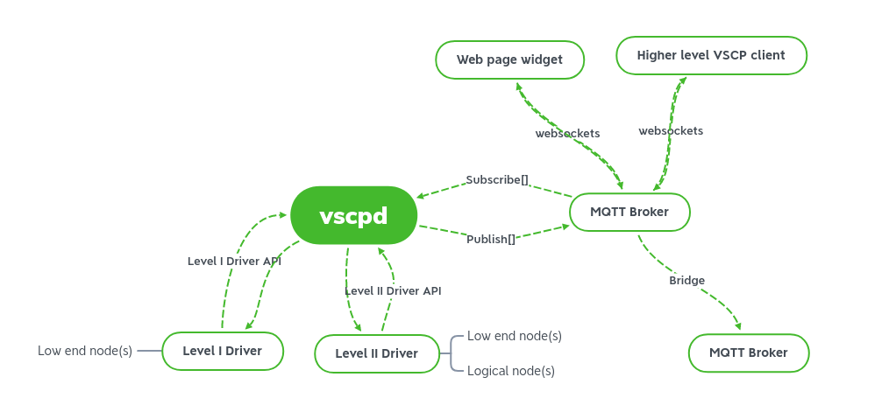

# Introduction to the VSCP Daemon Software

The VSCP daemon is an interface between low level devices and the higher end device world. It can also connect to other VSCP servers and hardware nodes forming large and complex systems. The low end devices may be VSCP enabled or other types of devices thant know nothing about VSCP. The driver system of VSCP serve as a hardware abstraction layer that makes it possible to connect to anything that is out there. 

Two sorts of drivers are available, **Level I** and **Level II**, with slightly different capabilities. It is easy to construct new drivers and there are plenty of sample code on how to do so.

From version 15.0 The VSCP daemon needs a MQTT broker but can be still also be used on it's own exporting different interfaces through installed drivers. 

## Overview

In the picture above a setup is sketched from VSCP's point of view. The VSCP daemon is shown subscribing/publishing to a specific MQTT broker. In reality this can be several MQTT brokers and and arbitrary subscriptions/publishing to each.

A bridge to another MQTT broker that connects two of them together is also shown. Bridging is a good way to secure data into specific physical/logical domains. Can also be any number of bridges.

Now imagine a low end node connected to the level I interface of the VSCP daemon. If it delivers a temperature event this event can pass through the VSCP daemon and get published to the MQTT broker. A widget on an internal web page widget can subscribe to events of this type and show the current temperature in it's presentation interface.

The other way around is when a web widget user push a button and a VSCP event is sent over websocket to the broker and the topic it is sent over is subscribed to by a level II driver which light up a Bluetooth lamp in the bedroom when it detected the event.

Note that the abstraction of a temperature and a button pressed is preserved all the way from the user interface to the low level driver. Its is thus very easy to replace the Bluetooth lamp with a Zigbee lamp.

Only websocket connection is shown to the MQTT broker but of course higher level clients can subscribe/publish from/to it at whish. The Bluetooth/Zigbee lamp could be connected here equally well as behind the VSCP daemon and a driver. Where a node fits best depends on the the setup and what one think is best.

[filename](./bottom_copyright.md ':include')
