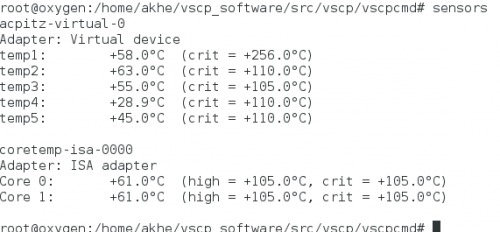
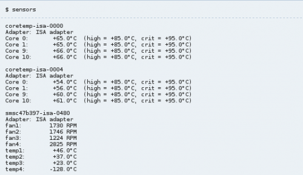
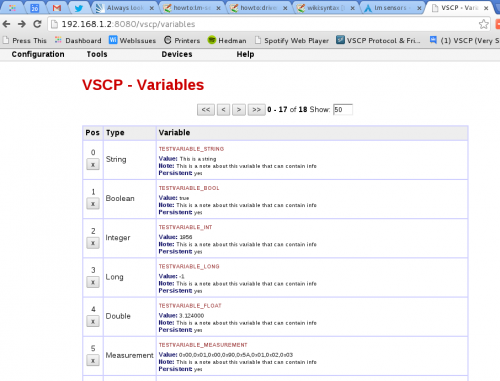
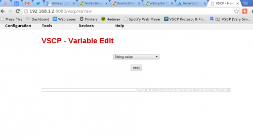
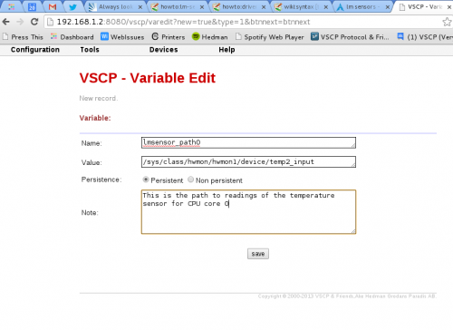
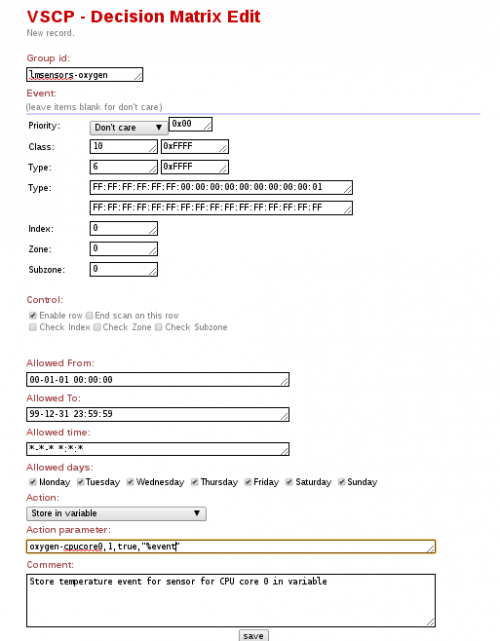
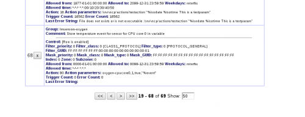
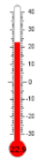
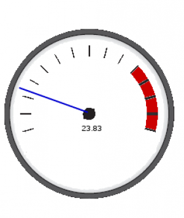

# lm-sensors Level II driver

**Available for**: Linux

lm-sensors is the effort of building and providing some essential tools for monitoring the hardware health of Linux systems containing hardware health monitoring hardware such as the LM78 and LM75. This ongoing project includes general libraries and hardware-specific software. Much of the work done could not have been done without the many knowledgeable programmers who laid down the foundation. The projects home page is [here](https://www.lm-sensors.org/). Examples of units that can be monitored is temperatures, voltage, and rpm of fans.

This driver is used to monitor sensors that are exported by the lm-sensors system or other systems and convert them to VSCP events that is sent out on user specified periodic intervals. 

As lm-sensor data is exported in the proc file system this driver can be used also for other sensors that can export it's data using this method or use an ordinary file as long as the data is numerical and is located at a specific offset in the file.

A good description on how to setup the lm-sensors system is [here](https://wiki.archlinux.org/index.php/Lm_sensors) and an example of how to use the lm-sensors driver is [here](https://www.vscp.org/wiki/doku.php/howto/driver_level2_lmsensors)

**Driver Linux**: vscpl2_lmsensorsdrv.so

The **configuration string** has the following format

    NumberOfSensors

##### NumberOfSensors

The parameter *NumberOfSensors* (which is optional) is the number of sensors the driver should report data from. This value can also be available as a VSCP daemon variable and if both are present the VSCP daemon variable will be used. 

 | Variable name     | Type    | Description | 
 | -------------     | ----    | ----------- | 
 | _numberofsensors  | integer | NumberOfSensors is the number of sensors the driver should report data from. | 
 | _path[0..n]       | string  | Path to the lm-sensor data file. | 
 | _guid[0..n]       | guid    | GUID to use when the data for the sensor is reported. | 
 | _interval[0..n]   | integer | Sample interval in seconds for events. | 
 | _vscptype[0..n]   | integer | VSCP Type to use for events. Currently the type must be one from [CLASS1.MEASUREMENT](http://docs.vscp.org/spec/latest/#/./class1.measurement) | 
 | _vscpclass[0..n]  | integer | VSCP class to use. Currently [CLASS1.MEASUREMENT](http://docs.vscp.org/spec/latest/#/./class1.measurement), [CLASS1.MEASUREMENT64](http://docs.vscp.org/spec/latest/#/./class1.measurement64), [CLASS1.MEASUREZONE](http://docs.vscp.org/spec/latest/#/./class1.measurezone), [CLASS1.SETVALUEZONE](http://docs.vscp.org/spec/latest/#/./class1.setvaluezone), [CLASS2.MEASUREMENT_STR](http://docs.vscp.org/spec/latest/#/./class2.measurement_str) is allowed. | 
 | _vscpindex        | integer | Needed index parameter if [CLASS2.MEASUREMENT_STR](http://docs.vscp.org/spec/latest/#/./class2.measurement_str), [CLASS1.MEASUREZONE](http://docs.vscp.org/spec/latest/#/./class1.measurezone) or [CLASS1.SETVALUEZONE](http://docs.vscp.org/spec/latest/#/./class1.setvaluezone) class is used                                                                                                                                                                                    | 
 | _vscpzone         | integer | Needed zone parameter if [CLASS2.MEASUREMENT_STR](http://docs.vscp.org/spec/latest/#/./class2.measurement_str), [CLASS1.MEASUREZONE](http://docs.vscp.org/spec/latest/#/./class1.measurezone) or [CLASS1.SETVALUEZONE](http://docs.vscp.org/spec/latest/#/./class1.setvaluezone) class is used.                                                                                                                                                                                    | 
 | _vscpsubzone      | integer | Needed subzone parameter if [CLASS2.MEASUREMENT_STR](http://docs.vscp.org/spec/latest/#/./class2.measurement_str), [CLASS1.MEASUREZONE](http://docs.vscp.org/spec/latest/#/./class1.measurezone) or [CLASS1.SETVALUEZONE](http://docs.vscp.org/spec/latest/#/./class1.setvaluezone) class is used.                                                                                                                                                                                 | 
 | _coding[0..n]     | integer | VSCP measurement coding to use for events. Not used if class is Index use if class is [CLASS2.MEASUREMENT_STR](http://docs.vscp.org/spec/latest/#/./class2.measurement_str)                                                                                                                                                                                                                                                                                                                          | 
 | _multiply[0..n]   | double  | This is the factor that will be multiplied with the value read from the lm-sensors file. If absent the value is multiplied by one. Note that this is a floating point value and can not be entered as a hex value.                                                                                                                                                                                                                                                                                            | 
 | _divide[0..n]     | double  | This is the factor that will be divided with the value read from the lm-sensors file. If absent the value is divided by one. Note that this is a floating point value and can not be entered as a hex value.                                                                                                                                                                                                                                                                                                  | 
 | _readoffset[0..n] | integer | Normally for a lm-sensors file the read offset should be 0 (default) as the value starts at zero offset. But for other files, such as the output from 1-wire tool such as [DigiTemp](http://www.digitemp.com), the offset to the data may be different.                                                                                                                                                                                                                                                       | 
 | _index            | integer | Index use if class is [CLASS2.MEASUREMENT_STR](http://docs.vscp.org/spec/latest/#/./class2.measurement_str), [CLASS1.MEASUREZONE](http://docs.vscp.org/spec/latest/#/./class1.measurezone) or [CLASS1.SETVALUEZONE](http://docs.vscp.org/spec/latest/#/./class1.setvaluezone)                                                                                                                                                                                                      | 
 | _zone             | integer | Zone use if class is [CLASS2.MEASUREMENT_STR](http://docs.vscp.org/spec/latest/#/./class2.measurement_str), [CLASS1.MEASUREZONE](http://docs.vscp.org/spec/latest/#/./class1.measurezone) or [CLASS1.SETVALUEZONE](http://docs.vscp.org/spec/latest/#/./class1.setvaluezone)                                                                                                                                                                                                       | 
 | _subzone          | integer | Subzone use if class is [CLASS2.MEASUREMENT_STR](http://docs.vscp.org/spec/latest/#/./class2.measurement_str), [CLASS1.MEASUREZONE](http://docs.vscp.org/spec/latest/#/./class1.measurezone) or [CLASS1.SETVALUEZONE](http://docs.vscp.org/spec/latest/#/./class1.setvaluezone)                                                                                                                                                                                                    | 
 | _unit             | integer | Unit use if class is [CLASS2.MEASUREMENT_STR](http://docs.vscp.org/spec/latest/#/./class2.measurement_str), [CLASS1.MEASUREZONE](http://docs.vscp.org/spec/latest/#/./class1.measurezone) or [CLASS1.SETVALUEZONE](http://docs.vscp.org/spec/latest/#/./class1.setvaluezone)                                                                                                                                                                                                       | 

The full variable name is built from the name you give the driver (prefix before _variablename) in vscpd.conf. So in the examples below the driver have the name **lmsensors1** and the full variable name for the **_index** will thus be

    lmsensors1_index

If you have another diver and name it  **lmsensors2** it will therefore instead request variable **lmsensors2_index**

If your driver name contains spaces, for example “name of driver” it will get a prefix that is “name_of_driver”. Leading and trailing spaces will be removed.

##### Example of vscpd.conf entry for the lm-sensors driver.

```xml
<driver enable="true" >
    <name>lmsensors1</name>
    <path>/usr/local/lib/vscpl2_lmsensorsdrv.so</path>             
    <config>2</config>
    <guid>00:00:00:00:00:00:00:00:00:00:00:00:00:00:00:00</guid>
</driver>
```

Example for variable configuration. In this sample the core temperature for two CPU's is reported as [CLASS1.MEASUREMENT, Type=6 temperature](http://docs.vscp.org/spec/latest/#/./class1.measurement#type6).

```xml
`<!-- ******************************************************** -->` 
`<!--          VSCP lmsensor Level II driver varibles          -->` 
`<!-- ******************************************************** -->`
`<!-- Number of sensors to read -->` 
`<variable type="int" >` 	
	<name>lmsensors_numberofsensors</name>          	
	<value>1</value>      
`</variable>`

`<!-- ******************************************************** -->` 
`<!--           Variabled for temperature CPU core 0           -->` 
`<!-- ******************************************************** -->`

`<!-- Interval for CPU core0 -->` 
`<variable type="int" >`           	
	<name>lmsensors_interval0</name>          	
	<value>1</value>      
`</variable>`

`<!-- VSCP GUID -->` `<variable type="guid" >`   
`<variable>`      	
    `<name>`lmsensors_guid0`</name>` 	
	<value>00:00:00:00:00:00:00:00:00:00:00:00:00:00:00:00</value>      
`</variable>`

`<!-- Path to sensor data file for CPU core 0 -->`  
`<variable type="string" >`                   	
`<name>`lmsensors_path0`</name>`          	
`<value>`/sys/class/hwmon/hwmon1/device/temp2_input`</value>`      
`</variable>`

`<!-- VSCP class value -->` 
`<variable type="int" >`          	
`<name>`lmsensors_vscpclass0`</name>` 	
`<value>`10`</value>`  `<!-- Measurement class -->`
`</variable>`

`<!-- VSCP Type value -->` 
`<variable type="int" >`          	
	<name>lmsensors_vscptype0</name> 	
	<value>6</value>  <!-- Temperature -->
`</variable>`

`<!-- Multiply value -->` 
`<variable type="int" >`          	
	<name>lmsensors_multiply0</name> 	
	<value>1</value>      
`</variable>`

`<!-- VSCP datacoding value -->` 
`<variable type="int" >`          	
	<name>lmsensors_datacoding0</name> 	
	<value>8</value> 
`</variable>`

`<!-- Divide value -->` 
`<variable type="int" >`          	
	<name>lmsensors_divide0</name> 	
	<value>1</value>      
`</variable>`

`<!-- ******************************************************** -->` 
`<!--           Variabled for temperature CPU core 0           -->` 
`<!-- ******************************************************** -->`

`<!-- Interval for CPU core1 -->` 
`<variable type="int" >`           	
	<name>lmsensors_interval1</name>          	
	<value>1</value>      
`</variable>`

`<!-- VSCP GUID -->` 
`<variable type="guid" >`          	
	<name>lmsensors_guid1</name> 	
	<value>00:00:00:00:00:00:00:00:00:00:00:00:00:00:00:00</value>      
`</variable>`

`<!-- Path to sensor data file for CPU core 1 -->`  
`<variable type="string" >`                   	
	<name>lmsensors_path1</name>          	
	<value>/sys/class/hwmon/hwmon1/device/temp3_input</value>      
`</variable>`

`<!-- VSCP class value -->` 
`<variable type="int" >`          	
	<name>lmsensors_vscpclass1</name> 	
	<value>10</value>  // Measurement class     
`</variable>`

`<!-- VSCP Type value -->` 
`<variable type="int" >`          	
	<name>lmsensors_vscptype1</name> 	
	<value>6</value>  // Temperature     
`</variable>`

`<!-- VSCP datacoding value -->` 
`<variable type="int" >`          	
	<name>lmsensors_datacoding1</name> 	
	<value>8</value> 
`</variable>`

`<!-- Multiply value -->` 
`<variable type="int" >`          	
	<name>lmsensors_multiply1</name> 	
	<value>1</value>      
`</variable>`

`<!-- Divide value -->` 
`<variable type="int" >`          	
	<name>lmsensors_divide1</name> 	
	<value>1</value>      
`</variable>`
```
 
----


# Using the Level II lm-sensors driver

The lmsensor driver can be used to read measurement data from files. It is built for the lm-sensors system but can be used to read data from any file that's got a numerical value in it at a specific offset.

You can read a sensor from one of the file as */sys/class/hwmon/hwmon0/device*/ for instance the */sys/class/hwmon/hwmon0/device/temp1_input*. In this file a temperature integer is available for read. You can get information on different temperatures such as CPU core temperatures and motherboard temperatures, fan rpms, voltage levels etc. But to do this you need to have the lm-sensors package installed and your mother board need a supported sensors.

##### Step 1

So fist install lm-sensors with

    $ sudo apt-get install lm-sensors

the run 

    sensors-detect
    
to detect and generate a list of kernel modules. You can read more about this [here](https://wiki.archlinux.org/index.php/Lm_sensors).

If you plan on using the daemon, be sure to answer YES when asked if you want to to generate */etc/conf.d/lm_sensors*. And then start the service with

    $ sudo systemctl enable lm_sensors.service

Now you can test your sensors with

    $ sudo systemctl enable lm_sensors.service
    
which on one of my machines gives a list like this


  

but on another machine gives this

  

##### Step 2

So now if I want to have a web-page that displays the temperatures on a live screen how do I do that?

First make sure you have the daemon installed and up and running on your machine. Step by step tutorials is available here [Getting started](howto/start)

##### Step 3

The driver for lm-sensors is named

    vscp2_lmsensorsdrv.so

and it is normally installed in */usr/local/bin*

The documentation for it is in the specification document 30.3

You need to have a driver entry in the  VSCP daemon configuration file located at /etc/vscp/vscpd.conf. These entries looks like

```xml	
<driver enable="true" >
	<name>lmsensors1</name>
	<path>/usr/local/lib/vscpl2_lmsensorsdrv.so</path>  
	<config>7</config>
	<guid>00:00:00:00:00:00:00:00:00:00:00:00:00:00:00:00</guid>
</driver>
```

**enable** is self explanatory and that goes for **name** as well. **guid** can be set to a valid GUID or all nilled in which case the GUID of the interface is used. Both works but if you want to have control of what GUID your sensed data will use (this is the address of it) you should set it to a valid value. There is many ways to obtain a valid GUID. You can construct one from your machines mac address for one or you can get your own personal serier of GUID by requesting one from [guid@vscp.org](guid@vscp.org). GUID's are explained in section 5 of the specification document.

We set it all nilled here as we can use the index portion of the event to identify the sensor.

The **config** part sets up the number of sensors. Here i have set 7 as there are seven temperature sensors to set up. Actually it could have been left blank as I will use the daemon variables in this example. 


##### Step 4

The variables we need to setup is:

lmsensors_numberofsensors which is an integer and in xml look like this

```xml	
<!-- Number of sensors to read -->
<variable type="int" >
	<note>Number of sensors to read</note>
	<name>lmsensors_numberofsensors</name>
	<value>7</value>
</variable>
```

note how the variable name is formed from the driver name (**lmsensors**) used as prefix and the parameter suffix (**_numberofsensors**). We set the value to 7 as we want to sense seven sensors.

Next we set the interval in seconds  we want the temperature for this sensor to be reported.

```xml	
<!-- Interval for CPU core 0 -->
<variable type="int" >
	<note>Interval for VPU core 0</note>
	<name>lmsensors_interval0</name>
	<value>1</value>
</variable>
```

Note the zero at the end of the variable name. This is the enumeration value for our seven sensors and will go from 0-6. Here we set the value to one to get a reading every second.

```xml	
<!-- VSCP GUID -->
<variable type="guid" >
	<note>GUID for measurement</note>
	<name>lmsensors_guid0</name>
	<value>FF:FF:FF:FF:FF:FF:00:00:00:00:00:00:00:00:00:0</value>
</variable>


Here we set the GUID (address) for this specific sensor. 

```xml
<!-- Path to sensor data file for CPU core 0 -->
<variable type="string" >	                      	
	<name>lmsensors_path0</name>
	<value>/sys/class/hwmon/hwmon1/device/temp2_input</value>
</variable>


Here we set the file the driver should read to get the temperature from this sensor.

```xml
<!-- VSCP class value -->
<variable type="int" >
	<note>VSCP Class</note>
	<name>lmsensors_vscpclass0`</name>
	<value>10</value>  <!-- Measurement class -->
</variable>
```

Here we set the VSCP class to use. In this case CLASS1.MEASUREMENT the standard measurement class. Documented in section 12.4 of the specification document.


```xml	
<!-- VSCP Type value -->
<variable type="int" >
	<note>VSCP type</note>
	<name>lmsensors_vscptype0</name>
	<value>6</value>  <!-- Temperature -->
</variable>
```


Here is the VSCP type belonging to CLASS1.MEASUREMENT above and which says this is a temperature measurement.

```xml	
<!-- VSCP datacoding value -->
<variable type="int" >
	<note>Integer, Celsius temperature</note>
	<name>lmsensors_datacoding1</name>
	<value>8</value>
</variable>
```

This tells how the data should be coded and i described in section 6 of the VSCP specification document. **Currently only integer coding is supported.** The data coding byte is a byte value and have eight bits that is divided into three groups. Bit 0-2 is the sensor index. A sensor index value of 0-7 can be sett here. Bits 3,4 tells the unit for the data and last bit 5-7 which tells how the data i coded.

In our case we have 8 which is 00001000 in binary form. So bits 0-2 is 000 meaning this sensor has index 0, bit 3-4 is 01 meaning that this is the second of three possible presentation units Kelvin = 00, Celsius = 01 and Fahrenheit = 10, that is we have a temperature with Celsius as unit in this case. Bits 5-7 is 000 telling that this is an integer among many other choices.
     

```xml	
<!-- Multiply value -->
<variable type="int" >
	<note>``</note>`
	<name>`lmsensors_multiply0`</name>` 	
	<value>`1`</value>`      
</variable>`
	
<!-- Divide value --> 
<variable type="int" >
	<note>Divide by 1000 to get centigrades.</note> <name>lmsensors_divide0`/name>
	<value>1</value>
</variable>
```

These two we could have left out as the value we read already is an integer and is ready to be read. But we could have multiplied it with an integer value and divided it with a value to get it in another form. Typical use is if we have a fractional value such as 9.234. We then can multiply this value with 1000 to get 9234 and can by that avoid using floats. Something that can be valuable on resource limited machines. Sometimes using a float is simpler and better.

For the rest of the sensors we want to monitor this we just need to enter the path to the file that holds the information. On my machine the seven paths is

    
    /sys/class/hwmon/hwmon1/device/temp2_input - for CPU core 0
    /sys/class/hwmon/hwmon1/device/temp3_input - for CPU core 1
    /sys/class/hwmon/hwmon0/device/temp1_input -
    /sys/class/hwmon/hwmon0/device/temp2_input -
    /sys/class/hwmon/hwmon0/device/temp3_input -
    /sys/class/hwmon/hwmon0/device/temp4_input -
    /sys/class/hwmon/hwmon0/device/temp5_input -
    
There are other values that could be read also

    /sys/class/hwmon/hwmon1/device/temp2_crit - 
    /sys/class/hwmon/hwmon1/device/temp2_max  -
    /sys/class/hwmon/hwmon1/device/temp2_crit_alarm - 0=no alarm, 1=alarm
    
    /sys/class/hwmon/hwmon1/device/temp3_crit - 
    /sys/class/hwmon/hwmon1/device/temp3_max  -
    /sys/class/hwmon/hwmon1/device/temp3_crit_alarm - 0=no alarm, 1=alarm
    
    /sys/class/hwmon/hwmon0/device/temp1_crit -  
    /sys/class/hwmon/hwmon0/device/temp2_crit - 
    /sys/class/hwmon/hwmon0/device/temp3_crit - 
    /sys/class/hwmon/hwmon0/device/temp4_crit - 
    /sys/class/hwmon/hwmon0/device/temp5_crit -
    
possible with a much lower update rate.

You can find the complete list for my computer here
   
[lm-sensor example variables](lm-sensor example variables)

The XML configuration code you have made here goes into the **/etc/vscp/varaibles.xml** file.

There is another way to enter code into this file. You can use the daemons web interface to do it. If your point your browser at (replace 192.168.1.2 with your server and if you have changed port replace 8080 with that port number).

    http://192.168.1.2:8884/vscp/variables
    
you will get a list with defined variables like this one



To edit a variable just click on it. To enter a new variable use the **Configuration/Variable - new** menu entry. After selecting this you have to select which type of variable you want to create. We make a string variable in this case

 


Then hit **next** and you can input data for the variable   
  


 

save it and your done. Let **persistent** be checked. This means the variable will be saved and loaded again when the daemon i started.

What method you want to use to input variables is up to you. 

In version 0.4.0 Fluorine, which is the active version when this is written, there is no method yet to start/shutdown/stop/restart a driver so you have to restart the daemon for the driver to read in the new data. This functionality will be added in the future. You restar the daemon with

    $ /etc/initd/vscpd restart
    
## Save the measurement in a variable

VSCP is an event based system so when something happens an event is sent and can be received. Most of the time this is just a good thing. Sometimes it can be less good. Think for instance of a situation where you start up a system and want to display the current state of things. Before you get any events from the things you monitor you can't tell there state. There are two solutions on this. Either you have to ask the state or you have something in between that does that for you. 

This is a case when VSCP daemon variables is very good. When an event comes in you store it in a variable instead and then in your presentation interface you read that variable instead of the event. The websocket interface allowes you to read variables

Easiest way to do this is to use the internal web-interface of the VCSP daemon. Select **Configuration/Variable -new** and fill in the data

 

Of course if you rather prefer to write in the information in the configuration file yourself you can do that to. Its by default located at **/etc/vscp/dm.conf** and the format is specified in the VSCP specification document section 16.16.7.

The VSCP daemon internal decision matrix functionality is described in the VSCP specification document section 14.7  The functionality of it in short is that if an event comes in an meet certain criteria the VSCP daemon does an action, in this case store the event in a variable.

**Group id** is a way to group DM entries together. We have no need for this functionality now so we just enter a name here. 

**Priority** we don't care for. 

**Class** we set to 6 which is CLASS1.MEASUREMENT and **type** we set to 6 which together form the temperature measurement event (ĆLASS1.MEASUREMENT, Temperature). The **mask** for both is 0xFFFF is in hexadecimal notation and tells that all its 10 and 6 we are interested in, nothing else.

Same is true for FF:FF:FF:FF:FF:FF:00:00:00:00:00:00:00:00:00:01 in the **GUID**. The **mask** is  FF:FF:FF:FF:FF:FF:FF:FF:FF:FF:FF:FF:FF:FF:FF:FF so this GUID is all we are interested in.

**Index**, **zone**, **subzone** we don't case about and set them all to zero. 

**Enable row** is selected so that this element will be parsed and checked.

**Allowed From** and **Allowed To** are dates between which this action can occur. I this case it should be always so we set a date in the past and a date in the future.

**Allowed Time** is set to **-*-* *:*:** which also is always and the days of the week are all selected.

So if an event CLASS1.MEASUREMENT, Temperature with GUID set to FF:FF:FF:FF:FF:FF:00:00:00:00:00:00:00:00:00:01 comes in the action we set will be performed. In this case store the event in the variable named by the action parameter (oxygen-cpucore0,1,true,"%event").

Instead of saving the event in a variable we could have executed a program or many other things if that suited our needs or if we want we just add another DM entry and do some other things there. We can have many things done for a single event.

So what about the action-parameter, **oxygen-cpucore0,1,true,"%event"**. What does it mean? It say we should store the entire event in a variable called **oxygen-cpucore0** and enclose it with quotation marks. Variable type = 1 = string and it is a persistent (true). If the variable did not excist it will be created.

  
   
## Showing the result in a web-page

 


You now know how to take care of variables in the decision matrix of the daemon so you can log data to a database, send them to other sources, or as we did above store them in variables.

It would have been very nice to show them on a web page. The best way to do this is to use the websocket interface of the VSCP daemon. It is described in section 14.9 of the VSCP specification. 

We can do this in two variants to show the power of this interface. First we show values in widgets that really looks like a thermometer and is dynamically updated and the as a textual representation that can be anywhere in the flow of a web-page and still be dynamic, live and nice.

A simple exeample is [here](https://youtu.be/qV41vWt5toE) that show one of the temperaturewidgets show temperature from a [Kelvin NTC10KA Module](https://www.grodansparadis.com/kelvinntc10k/kelvin_ntc10ka.html).

##### Step 1

The first thing you have to do is to install the websocket samples and make sure everything works. There is a special tutorial for this here [Websockets guide](howto/howto_start_websockets).

##### Step 2

Next you have to build a page to put the interface in. We do this in the **testws** folder of the websocket directory tree and if you have installed your stuff somewhere else you may need to change some paths. Especially the path to the VSCP widget library (//vscpwslib.js//). To start out we create a webpage.

	
```html	
<!DOCTYPE html PUBLIC "-//W3C//DTD HTML 4.01//EN" "http://www.w3.org/TR/html4/strict.dtd">
<html>
<head>
	<meta content="text/html; charset=ISO-8859-1" http-equiv="content-type">
	<title>VSCP HTML5 lm-sensors test</title>
	<!--
	`<link rel="stylesheet" type="text/css" href="../css/vscpdemo.css" />`
	-->
	
	<script type="text/javascript" src="settings.js">``</script>
	<script type="text/javascript" src="../lib/vscpwslib.js">``</script>
	
</head>
	
<body>
	
	<h1>VSCP HTML5 lm-sensors test</h1>
	
	<script>                                        
	</script>
	
</body>
</html>
```	


##### Step 3

To show the different temperature values we add a table. For simplicity we just show the values for the cpu cores here.

```html
<code="html">
<div>
    <table>
        <tr>
            <td>Temperature for CPU Core 0</td>
            <td><span id="cpu0"></span></td>
        </tr>
        <tr>
            <td>Temperature for CPU Core 1</td>
            <td><span id="cpu1"></span></td>
        </tr>
    </table>
</div>
```
 
##### Step 4

Then we need to add the code to actually show temperature values. We do this with

```javascript
var txtcpu0 = 
   new vscpws_simpleTextEvent( VSCP_WEBSOCKET_URL, 
                    "cpu0", 
                    VSCP_CLASS1_MEASUREMENT,
                    VSCP_TYPE_MEASUREMENT_TEMPERATURE,
                    0, // Sensorindex
                    0, // # decimals
                    "{0} degrees {1}",
                    "FF:FF:FF:FF:FF:FF:00:00:00:00:00:00:00:00:00:01");
```

And for the other cpu

```javascript
	var txtcpu1 = 
	   new vscpws_simpleTextEvent( VSCP_WEBSOCKET_URL, 
	                    "cpu1", 
	                    VSCP_CLASS1_MEASUREMENT,
	                    VSCP_TYPE_MEASUREMENT_TEMPERATURE,
	                    0, // Sensorindex
	                    0, // # decimals
	                    "{0} degrees {1}",
	                    "FF:FF:FF:FF:FF:FF:00:00:00:00:00:00:00:00:00:02");
```

**VSCP_WEBSOCKET_URL** is the url for the machine where the VSCP daemon is running. On my machine this is `"ws://192.168.1.20:7681"` note the "**ws**" instead of http/https  

**"cpu0"** and **"cpu1"** refers to the respective positions in the table where the values should be put. 

`VSCP_CLASS1_MEASUREMENT` and `VSCP_TYPE_MEASUREMENT_TEMPERATURE` is the event that carries the value. 

**Sesorindex** is not used here and therefore set to 0. 

# of decimals set to zero. 

And last we have the two GUID's, one for each sensor. 

That's what is needed. Just browse into this page and see the live values being updated.
 
##### Step 5

So if you want a graphical presentation instead? Its simple. Let us show some code on how to get the speedometer to show the two cpu temperatures.


 

##### Step 6

The first we need is a canvas located at some position on the screen 

```html	
<canvas id="speedometer_cpu0"
	style="z-index: 1;
		position:absolute;
		left:100px;
		top:200px;" >
	Your browser does not support HTML5 Canvas.
</canvas>
```

next we need to create the widget

```javascript	
var temp1 = new vscpws_speedometerCelius( 			
					VSCP_WEBSOCKET_URL, 
	                 "speedometer_cpu0", 
	                 0,      // Widget type
	                 VSCP_CLASS1_MEASUREMENT,
	                 VSCP_TYPE_MEASUREMENT_TEMPERATURE, 
	                 0,      // Sensor index
	                 true,   // numerical printout
	                 "FF:FF:FF:FF:FF:FF:00:00:00:00:00:00:00:00:00:01" );
	temp1.setDecimals(0); // Don't show any decimals
```

That's it.


## Related Links


*  https://wiki.archlinux.org/index.php/Lm_sensors
*  https://www.kernel.org/doc/Documentation/hwmon/sysfs-interface
*  http://www.lm-sensors.org/wiki/ProjectInformation
*  http://askubuntu.com/questions/53762/how-to-use-to-use-lm-sensors
*  http://www.lm-sensors.org/wiki/FAQ/Chapter2
*  http://stackoverflow.com/questions/10150415/using-lm-sensors-to-get-temperature
*  https://wiki.archlinux.org/index.php/Lm_sensors


[filename](./bottom_copyright.md ':include')
