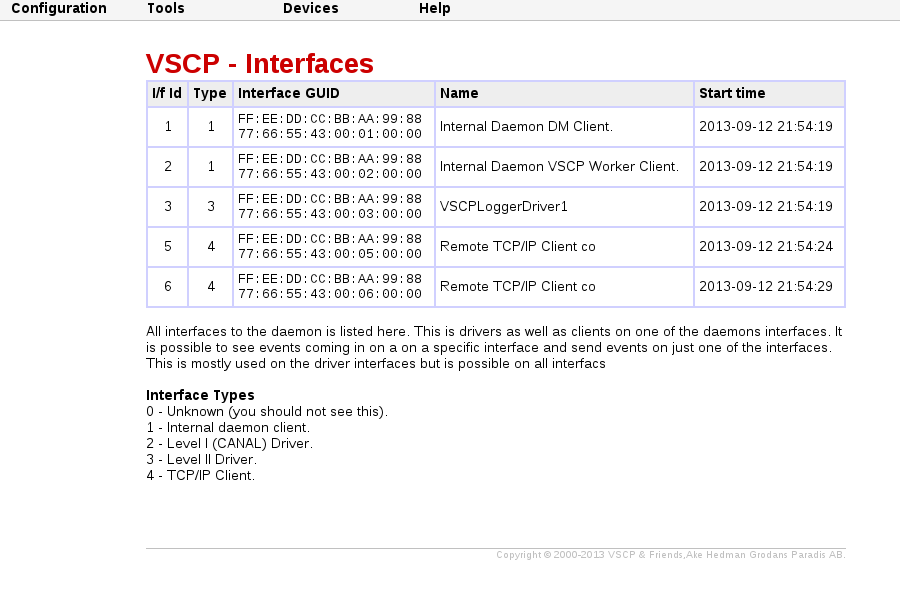
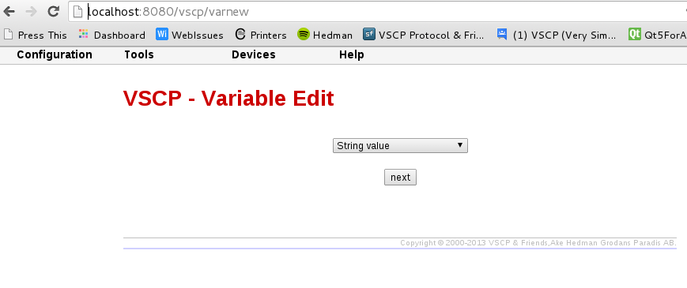

# MQTT level II driver

**Available for:** Linux, Windows

MQTT provides a lightweight method of carrying out messaging using a publish/subscribe model. This makes it suitable for "machine to machine" messaging such as with low power sensors or mobile devices such as phones, embedded computers or micro controllers like the Arduino. A good example of this is all of the work that Andy Stanford-Clark (one of the originators of MQTT) has done in home monitoring and automation with his twittering house and twittering ferry. The MQTT protocol is maintained by IBM.

This driver allow publishing of VSCP events as well as subscribing to VSCP events.

To build and use the driver you need yo install the Mosquitto library. You can find instruction on how to do that [here](installing_moquitto_for_use_with_vscp.md).


## Driver

**Driver Linux:** vscpl2_mqttdrv.so
**Driver Windows:** vscpl2_mqttdrv.dll
## Configuration String

The configuration string have the following format

    “sessionid";"subscribe”|”publish”;channel;host;user;password;keepalive;filter;mask

The first configuration parameter is a unique id like "mysession22" for your connection. The second parameter tell if the intention is to subscribe (“subscribe”) to an existing MQTT channel or to publish (“publish”) events on a channel. The second parameter is the topic. This is a text string identifying the topic. It is recommended that this string starts with “vscp/”. Host is the host where the MQTT broker is located (defaults to "localhost:1883"). **Note that port must be included in the hostname.** User/password is credentials for the channel if they are needed. 

**Note**
"sessionid" is introduced from version 1.1.0.22 Sodium. Skip for earlier versions.

## Variables

 | Variable name  | Type    | Description   | 
 | -------------  | ----    | -----------  | 
 | **_sessionid** | string  | A unique session id ("myconnection2") you set for every connection to a broker. The session id's must be different if load several MQTT drivers and also so if the connect to the same broker. Available from version 1.1.0.22 Sodium.               | 
 | **_type**      | string  | “subscribe” to subscribe to a MQTT topic. ”publish” to publish events to a MQTT topic. Defaults to “subscribe”.                                                                                                                          | 
 | **_topic**     | string  | This is a text string identifying the topic. It is recommended that this string starts with “vscp/”. Defaults to “vscp”                                                                                                                      | 
 | **_host**      | string  | IP address or a DNS resolvable address to the remote host. Mandatory and must be declared either in the configuration string or in this variable. __Note that port must be included in the hostname.__ Defaults to “localhost:1883”              | 
 | **_user**      | string  | Username used to log in on the remote MQTT sever. Defaults to empty. Currently not used.                                                                                                                                                             | 
 | **_password**  | string  | Password used to login on the remote MQTT server. Defaults to empty. Currently not used.                                                                                                                                                             | 
 | **_keepalive** | integer | Keepalive value for channel. Defaults to 60.                                                                                                                                                                                                         | 
 | **_filter**    | string  | Standard VSCP filter in string form. 1,0x0000,0x0006,ff:ff:ff:ff:ff:ff:ff:01:00:00:00:00:00:00:00:00 as priority,class,type,GUID Used to filter what events that is received from the socketcan interface. If not give all events are received/sent. | 
 | **_mask**      | string  | Standard VSCP mask in string form. 1,0x0000,0x0006,ff:ff:ff:ff:ff:ff:ff:01:00:00:00:00:00:00:00:00 as priority,class,type,GUID Used to filter what events that is received from the socketcan interface. If not give all events are received/sent.   | 
 | **_simplify**  | string  | Makes it possible to publish and subscribe data in a human handleable form. See below for more information.                                                                                                                                          | 

The full variable name is built from the name you give the driver (prefix before _variablename) in vscpd.conf. So in the examples below the driver have the name **mqtt1** and the full variable name for the **_sessionid** will thus be

    mqtt1_sessionid

If you have another driver and name it  **mqtt2** it will therefore instead request variable 

    mqtt2_sessionid

and so on.

If your driver name contains spaces, for example “name of driver” it will get a prefix that is “name_of_driver”. Leading and trailing spaces will be removed.

### _simplify

If this variable is defined it will simplify the effort to publish measurement or subscribe to measurement information. It makes it as simple as 1-2-3 and allows for  sending just numbers over MQTT but still get valid events into the system. The functionality works also the other way around  so measurement events can send data over MQTT as just a number possibly using the MQTT topic as a way to tell what is sent.

For a publishing channel it may be wise to set a filter in the driver so only the events of interest is published.

The format for the simplicity variable varies for the VSCP class one want to use

**[CLASS1.MEASUREMENT](http://docs.vscp.org/spec/latest/#/./class1.measurement)**

Only **string** and **float** coding is allowed. For string the number can be a maximum of seven characters.

The variable format is

    10, vscp-type,float|string, sensoridx(0-7), unit(0-7)

([VSCP types are here](http://docs.vscp.org/spec/latest/#/./class1.measurement)) so if you code a simplify variable as

    10,6,float,3,1

for a subscribe setup a number like "23.78" send over MQTT will be converted to a valid VSCP event [CLASS1.MEASUREMENT, Type=6, temperature](http://docs.vscp.org/spec/latest/#/./class1.measurement#type6) and with unit set to degrees Celsius and sensor index set to 2 and where the data is a single precision floating point number (32-bit). The setup is of course the same for a publish setup. __The GUID for the interface will be used__.

If you select a float or a string is just a matter of preference in most cases but the floating point value is often the best choice.

**[CLASS2.MEASUREMENT_FLOAT](http://docs.vscp.org/spec/latest/#/./class2.measurement_float)**

If you need a floating point value with more precision this is the choice. It uses a double (64-bit) double precision floating point number.

The variable format is

    1060, vscp-type, sensoridx(0-255), unit(0-255), zone(0-255), subzone(0-255)

([VSCP types are here](http://docs.vscp.org/spec/latest/#/./class1.measurement))

**[CLASS2.MEASUREMENT_STR](http://docs.vscp.org/spec/latest/#/./class2.measurement_str)**

This measurement format allow for a decimal measurement ("." is decimal separator) which allow for a maximum of 483 digits including a possible decimal point. So if you need a lot of numbers this is the format for you.

The variable format is

    1040, vscp-type, sensoridx(0-255), unit(0-255), zone(0-255), subzone(0-255)

([VSCP types are here](http://docs.vscp.org/spec/latest/#/./class1.measurement))

## vscpd.conf example

```xml
<driver enable="true" >
    <name>mqtt1`</name>
    <path>/usr/local/lib/vscp2drv_mqtt.so</path>
    <config>"mysession1";publish;vscp;localhost:1883</config>
    <guid>`00:00:00:00:00:00:00:00:00:00:00:00:00:00:00:00</guid>
</driver>
```

The format for data on the MQTT wire is the same as the format for sends and receives in the TCP/IP interface. This means they look like this

    head,class,type,obid,datetime,timestamp,GUID,data0,data1,data2,..........

and as usual the GUID can be replaced by “-” to use the interface GUID.

Using the methods

    vscphlp_writeVscpEventToString
    vscphlp_writeVscpEventExToString
    vscphlp_setVscpEventFromString 
    vscphlp_setVscpEventExFromString

available in the vscphelper library (C/C++/C#/Python/PHP/node.js) it is easy to convert between VSCP Event and text form. It is also very easy to get other properties from the event such as real number measurement with the help of the same library.

# Using the MQTT driver

MQTT is a protocol for M2M by IBM. This driver makes it possible to use MQTT as the transport for VSCP events. As MQTT, with the help of IBM's muscle mass, is available on many, many platforms this can be a way to enter events into or fetch events from the VSCP framework. Thus any device that can use MQTT can connect to a websocket button or show it's data in a table or log data to a database.

For measurements it be as easy as 1-2-3. You just send or fetch data and the driver do the VSCP translations to full events for you.     

## Setting up the needed MQTT subsystem

*I have tested this on several Debian and Ubuntu boxes and on a Rasbian driven Raspberry Pi board. On all I tested you can jump directly to step 4. If that does not work start at step 1.*

To use the driver the MQTT [ Mosquitto](https://mosquitto.org/ ) or similar broker is needed. To do this follow the steps below. Taken from [here](installing_moquitto_for_use_with_vscp.md)

##### Install a MQTT broker and a client

Install the Mosquitto server and clients

    $ sudo aptitude install mosquitto
    $ sudo aptitude install mosquitto-clients

You are now ready to use the MQTT subsystem.

To test that everything works you can now open a terminal window and issue

    $ mosquitto_sub -d -t hello/world
    
to subscribe to the **hello/world** channel. And then open another terminal window and issue 

    $ mosquitto_pub -d -t hello/world -m "Hello World"
    
if everything works "Hello World" will come up in the subscribe window. You can of course do this on different machines also. On one machine issue

    $ mosquitto_sub -h YOUR_HOST_IP_ADDRESS -d -t hello/world
    
and on the other issue

    $ mosquitto_pub -d -t hello/world -m "Hello World"
    
as before. If this does not work you may need to open the 1883 port in your firewall. For this use  

    sudo iptables -A INPUT -p tcp -m tcp --dport 1883 -j ACCEPT
    

## Setting up the MQTT driver

You can find the documentation for the driver [here](./level2_driver_mqtt.md)

### Publish

The first thing you should do is to add the driver to the VSCP daemon configuration file. To do this look up the `<vscpdriver>`  ...  `</vscpdriver>` tags in the file and add

```xml
<driver enable="true">
    <name>VSCP MQTT Publisher driver 1</name>
    <path>/usr/local/lib/vscpl2drv_mqtt.so</path>
    <config>mysession2;publish;vscp;localhost:1883</config>
    <guid>00:00:00:00:00:00:00:00:00:00:00:00:00:00:00:00`</guid>
</driver>`
```

Select a name that works for you. **enable** should be set to *true* for the driver to be loaded and to *false* if not. This can be convenient if you want to have a driver in the configuration file but not want to enable it.

The **path** may be different on your system but */usr/local/bin* is the default installation path on most systems. Replace with the correct path if its different on your system.

**GUID** is all set no zeros here which means the GUID of the interface will be used. You can leave it out if you want to give the same effect or you can set it to a unique id.

The **config** item tells how your driver should work. It is a semicolon separated list with items that is fully described in the specification document. 

The first item in this list can be *subscribe* or *publish* depending if you want VSCP events to be sent or received, publish is used in this example as we want to publish events.

The second is the the **topic**. This is the MQTT term for a channel and is a slash separated list. You can use anything here but staring your topic with *vscp* is recommended. We use vscp here but could have used vscp/measurements/temperature/celsius or something similar instead. Use the topic that works for you.    

Next is the host where your Mosquitto daemon is installed (defaults to "localhost:1883") and must include the port and  the host is followed by an optional username and password.

To this list you can add a keepalive value which is the number of seconds the server expect to be feed with messages (Defaults to one minute) and a usual event filter/mask pair to select which events should be published or be received.

Restart the daemon with

    $ sudo /etc/init.d/vscpd restart
    
and subscribe to the published events with
 
    $ mosquitto_sub -d -t vscp

Events is presented in the form

    head,class,type,obid,datetime,timestamp,GUID,data0,data1,data2,...........
    
by default (this can be changed see below). You can use the  helper library and the methods


*  writeVscpEventToString
*  writeVscpEventExToString
*  getVscpEventFromString 
*  getVscpEventExFromString
*  getVSCPDataCodingAsString
*  getDataCodingFloat

to easily interpret the event.

You can easily control that the driver is loaded by using the internal web interface of the daemon and open

    http://localhost:8884/vscp/interfaces

replacing 

    http://localhost:8884
    
with your actual host and port. This will show something like this

   

where the driver with the name you given it will be visible in the list.     

### Subscribe

    
To subscribe to events on a channel use *subscribe* instead of *publish* above.

```xml
<driver enable="true" >
    <name>VSCP MQTT Subscriber driver 1</name>
    <path>/usr/local/lib/vscp2drv_mqtt.so</path>
    <config>subscribe;vscp;localhost:1883</config>
    <guid>00:00:00:00:00:00:00:00:00:00:00:00:00:00:00:00</guid>
</driver>
 ```   

 When the server is restarted and the driver is loaded you can publish VSCP events with

    $ mosquitto_pub -d -t vscp -m "0,20,3,0,0,0:1:2:3:4:5:6:7:8:9:10:11:12:13:14:15,0,1,35"

or

    $ mosquitto_pub -d -t vscp -m "0,20,3,0,0,-,0,1,35"

both of these will publish the VSCP event [CLASS1.INFORMATION TYPE=3 ON](http://docs.vscp.org/spec/latest/#/./class1.information?id=type3-0x03-on) event, for zone=1, sub-zone=35 typically used to tell that something has been turned on in zone=1, subzone=35. In the first case a specific GUID is used (0:1:2:3:4:5:6:7:8:9:10:11:12:13:14:15) and in the second the GUID of the interface has been used. You can use the interface GUID also by specifying the GUID to all nills (00:00:00:00:00:00:00:00:00:00:00:00:00:00:00:00) as always.

Use VSCP Works to examine published events received by the MQTT driver in a user friendly way or telnet to the TCP/IP interface of the daemon

    $ telnet localhost 9498
    
login with

    $ user admin
    $ pass secret

works on a newly installed system with the default configuration. Otherwise replace with your own credentials and also the host you have the daemon on of course if your not located at the same host.    

use

    $ retr
    
to retrieve one event from the input queue

or

    $ retr 25
    
if you want to fetch 25 or all that is collected. You can also use

    $ rcvloop
    
to see incoming events (use 'quitloop' to terminate the loop). The "+OK" you may see from time to time is a way for M2M routines to know the line is open as this is intended for machines.

In both cases events will be presented as

    head,class,type,obid,datetime,timestamp,GUID,data0,data1,data2,...........
    
All command of the daemon is described [here](./tcp_ip_control_interface.md).  

### Using variables


The configure string in the VSCP daemon driver configuration can be replaced by VSCP variables instead. Actually a value specified in a variable will be used before a value in a configuration string. So if you have both the variable value will have precedence.
 
All the variables for the MQTT driver is defined [here](./level2_driver_mqtt.md). There is one each for the configuration values defined above.

There is **_type** which in our case is the variable **vscp_mqtt_publisher_driver_1_type** and **vscp_mqtt_subscriber_driver_1_type**. As you see the driver name is prepended to the variable name (with spaces replaced by "_") to get the actual variable name. This method makes it possible to have serveral channels open at the same time with different configurations as long as they have different names. The _type variable can have the value "subscribe" or "publish" and is a variable of string type. 

You can create a variable in two ways.

Either you add them by hand to the variables configuration file in */etc/vscp/variables.xml*. So in this case you enter

```xml
<variable type="string" >
    <name>vscp_mqtt_publisher_driver_1_type</name>
    <value>publish</value>
    <note>bla bla bla bla</note>
</variable>
```

and/or

```xml
<variable type="string" >
    <name>vscp_mqtt_subscriber_driver_1_type</name>
    <value>subscribe</value>
    <note>bla bla bla bla</note>
</variable>
```

but is is probably easier to use the built in web interface of the daemon to do the same thing. Head your browser to 

    http://localhost:8884/vscp/varnew
    
replacing [http://localhost:8884](http://localhost:8884) with your actual *host* and *port*.   
 

In this first screen you select the value to be a *string* and then move on with the *next*  button \\ 




In the next screen you enter the name and the value for the variable as you did above and also make sure to mark persistent so the variable will be saved and thus available also after the daemon has been restarted. When you are ready press save 
    
[](./images/drivers/mqtt/variable_string_edit_step2.png)


which will take you back to the variable list where you can click on any item to edit it.


[](./images/drivers/mqtt/variable_string_edit_step3.png)


### Example: Subscribing

If you enter a driver entry like this in the */etc/vscp/vscpd.conf* file

```xml
<driver enable="true" >
    <name>VSCPMQTTDriver1</name>
    <path>/usr/local/lib/vscp2drv_mqtt.so</path>
    <config>mysession3;publish;vscp1;localhost:1883</config>
    <guid>00:00:00:00:00:00:00:00:00:00:00:00:00:00:00:00</guid>
</driver>
```    
    
you can subscribe to the events published using  

    mosquitto_sub -d -t vscp1

And if for instance you have a temperature sensor in your system you will get events looking like this

    0,10,6,FF:EE:DD:CC:BB:AA:99:88:77:66:55:43:00:16:00:00,0x68,0x44

This is the textual representation of a VSCP event. It has the form

    head,class,type,obid,datetime,timestamp,guid,data,,,

The **GUID** (always presented in hexadecimal) tells from which interface or device/sensor this event comes from. It as all data in VSCP comes with the MSB byte first. 

class and type is the event class and the event type, In this case *class=10* so we know its a **CLASS1.MEAUREMENT** and type=6 so we can tell this is a measurement of a temperature. **CLASS1.MEAUREMENT** gives information about how the data that follows is packed. As we see there is two databytes 0x68 and 0x44. For **CLASS1.MEAUREMENT** the first byte of the data is a data coding byte which tells how the rest of the data is coded in the upper three bits. In this case 0x68 = 01101000 the upper bits are 011 which says an integer follows. An integer that can take up 1-7 byte with the most significant byte first. In this case our integer is juts one byte. 

So what we have is the temperature 0x44 which is 68 in decimal. But in what unit is it presented? To know that we can investigate bit 3 and 4 which are 01 which in turns tell us that it is a temperature reading in Celsius. It could have been 00 for a Kelvin reading or 10 for a Fahrenheit reading. 

The lowest three bits are all zero here but could have been an index (0-7) to a specific sensor on the device that is identified by GUID 

**FF:EE:DD:CC:BB:AA:99:88:77:66:55:43:00:16:00:00**
    
### More to read


* [Using the VSCP MQTT driver Part 1](https://grodansparadis.com/wordpress/?p=1533)
* [Using the VSCP MQTT driver Part 2](https//grodansparadis.com/wordpress/?p=1528)
* MQ Telemetry Transport - https://mqtt.org/
* MQTT V3.1 Protocol Specification - https://public.dhe.ibm.com/software/dw/webservices/ws-mqtt/mqtt-v3r1.html#keep-alive-timer
* Mosquitto - https://mosquitto.org/
*  Using the API - https://www.eclipse.org/paho/files/mqttdoc/Cclient/
*  MQTT på arduino - https://knolleary.net/arduino-client-for-mqtt/


[filename](./bottom_copyright.md ':include')