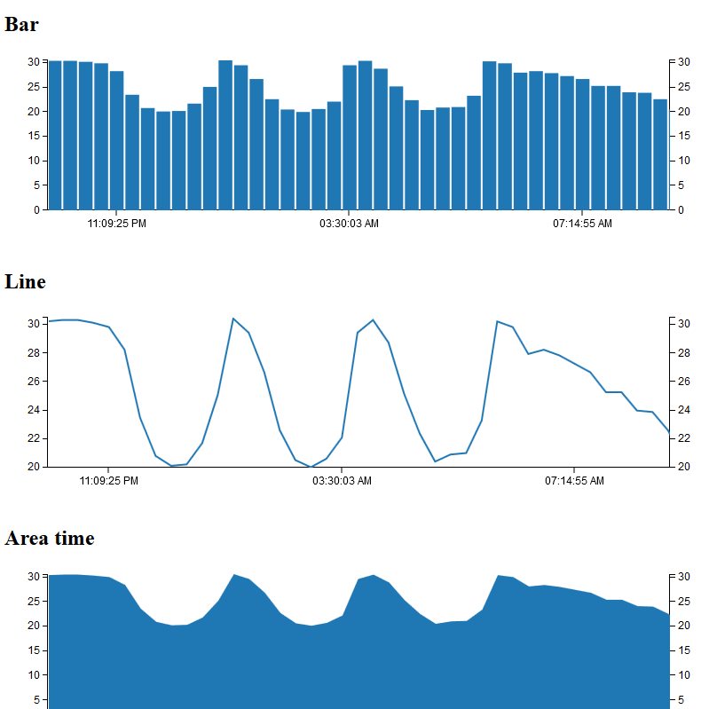
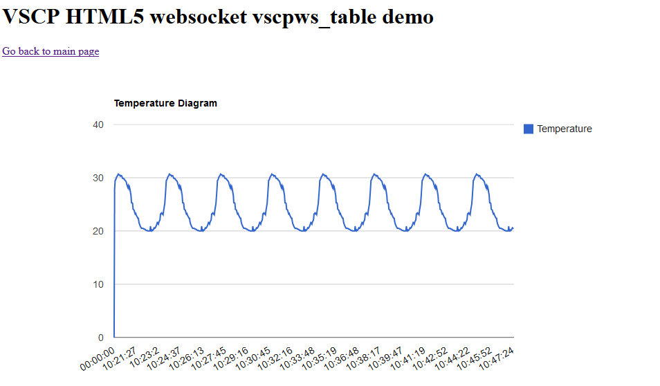
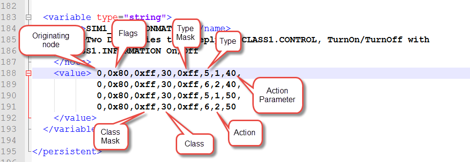

# Simulation Level II driver

**Available for**: Linux, Windows

With this simulated VSCP module it is possible to get measurement events injected into the system and to react on button press events that send TurnOn/TurnOff events. The simulation is primarily built for the user interface demo code that comes with VSCP & Friends but will be extended to do other things in the future.

**This is work in progress.** The driver will be a full level I and Level II node simulation by time. Currently it is usable to get periodic measurement events and to have a counterpart for button press events (confirmations).

**Driver Windows**: vscpl2_sim.dll  
**Driver Linux**: vscpl2_sim.so

If you have problems starting this driver on a unix machine you can use

    tail -f /var/log/syslog | grep VSCPSimDrv 

to get information on possible problems reported from the driver.  





The configuration string has the following format

    NumberOfNodes

##### NumberOfNodes

The parameter *NumberOfNodes* (which is optional) is the number of simulated devices the driver should report data from. Sensors will be assigned in the order they are started so nicknames will be 1,2,3 etc.   This value can also be set as a VSCP daemon variable and if both are present the VSCP daemon variable will be used. __Default is 1.__ 

 | Variable name  | Type    | Description | 
 | -------------           | ----    | ----------- | 
 | _numberofnodes          | integer | NumberOfNodes is the number of simulated nodes the driver should report data from. | 
 | _blevel2[0..n]          | boolean | True if this is a level II node. Full GUID will be used in that case. | 
 | _zone[0..n]             | integer | This is the zone for the simulated module. | 
 | _subzone[0..n]          | integer | This is the subzone for the simulated module.  | 
 | _guid[0..n]             | guid    | GUID to use when the data from the node is reported. A level II node must have a GUID assigned to it. For a level node all bytes of the GUID except for the lsb byte can be set to zero to indicate that the GUID of the interface should be used. | 
 | _path[0..n]             | string  | Path to measurement simulation data file. The data in this file is sent out as measurement events of the selected type in a round robin fashion. If not give a built in series of data will be used.  | 
 | _interval[0..n] | integer | Sample interval in seconds for events. Set to zero to turn off. Default is 30 seconds. | 
 | _unit[0..n]             | integer | Unit use. Allowed values is units listed for the defined measurement types. | 
 | _index[0..n]            | integer | Measurement index 0-7. Default is 0. | 
 | _coding[0..n]           | integer | Message coding 0-2. Default is 0. Allowed values 0=Normalized integer, 1=floating point, 2=string. | 
 | _decisionmatrix[0..n]   | string  | Comma separated list with decision matrix elements. Values can be decimal or hexadecimal and should, if hexadecimal, be preceded with "0x".  | 
 | _measurementclass[0..n] | long    | Class used for sent measurement events. Default is [CLASS1.MEASUREMENT](http://docs.vscp.org/spec/latest/#/./class1.measurement)                                                                                                          | 
 | _measurementtype[0..n]  | long    | Type used for sent measurement events. Default is [Type=6, Temperature](http://docs.vscp.org/spec/latest/#/./class1.measurement#type6-0x06-temperature)                                                                                                          | 

The full variable name is built from the name you give the driver (prefix before _variablename) in vscpd.conf. So in the examples below the driver have the name **sim1** and the full variable name for the **_zone0** will thus be 

   sim1_zone0 

If you have another diver and name it sim2 it will therefore instead request variable **sim2_zone0**

If your driver name contains spaces, for example “name of driver” it will get a prefix that is “name_of_driver”. Leading and trailing spaces will be removed. 

##### Example of vscpd.conf entry for the simulation driver.

```xml
<!-- Level II simulation  -->
<driver enable="true">	   	 			
    <name>sim1</name>
    <config>1</config>
    <path>/usr/local/lib/vscpl2_simdrv.so</path>
</driver>
```

The name **"sim1"** will be preceded in front of all variable names as **sim1_variablen** where n is the ordinal starting from zero (sim1__index0, sim1_coding0, etc). 

The config string is set to 1 in this case meaning we should only simulate one node. There is only one parameter to set for this driver and it will be overridden if there is a variable defined as **sim1_numberofnodes0**.

##### Example of decision matrix (dm.xml) entry for the simulation driver.

```xml
<!-- 
    One simulated node that report temperature values 
    The NumberOfNodes can be specified in the driver configuration 
    string instead and does not need to be in configuration file.
-->
<variable type="integer">
    <name>SIM1_NUMBEROFNODES`</name>
    <note>
	Number of simulated nodes this driver should act as. Each of them should
        have an entry below with the index of the driver ordinal as the last character
        in there name. All variables names start with the driver unique prefix "sim_" 
        in this case.
    </note>
    <value>1</value>
</variable>

<variable type="boolean">
    <name>SIM1_BLEVEL0</name>
    <note>This is a Level I node.</note>
    <value>false</value>
</variable>

<variable type="integer">
    <name>SIM1_ZONE0`</name>
    <note>Zone for module.</note`
    <value>1</value>
</variable>

<variable type="integer">
    <name>SIM1_SUBZONE0</name>
    <note>Zone for module.</note>
    <value>2</value>
</variable>

<variable type="guid">
    <name>SIM1_GUID0`</name>
    <note>GUID for the node.</note>
    <value>11:00:00:00:00:00:00:00:00:00:00:00:00:00:00:00</value>
</variable>

<variable type="string">
    <name>SIM1_PATH0</name>
    <note>Path to simulation data. Leave blank to use internal values.
    </note>
    <value>c:/tmp/simtempdata.txt</value>
</variable>

<variable type="integer">
    <name>SIM1_INTERVAL0</name>
    <note>Interval between measurement events.</note>
    <value>2</value>
</variable>

<variable type="long">
    <name>SIM1_MEASUREMENTCLASS0</name>
    <note>CLASS1_MEASUREMENT</note>
    <value>10</value>
</variable>

<variable type="long">
    <name>SIM1_MEASUREMENTTYPE0</name>
    <note>Measurement type is temperature.</note>
    <value>6</value>
</variable>

<variable type="integer">
    <name>SIM1_UNIT0</name>
    <note>`Degrees Celsius (0=Kelvin, 1=Fahrenheit).</note>
    <value>1</value>
</variable>

<variable type="integer">
    <name>SIM1_CODING0</name>
    <note>`Coding as normalized integer. (0=normalized integer, 1=float, 2=string)</note>
    <value>0</value>
</variable>

<variable type="integer">
    <name>SIM1_INDEX0`</name>
    <note>Sensor index (0-7).</note>
    <value>2</value>
</variable>

<variable type="string">
    <name>`SIM1_DECISIONMATRIX0</name>
    <note>
      Two DM entries that reply to CLASS1.CONTROL, TurnOn/TurnOff with 
      CLASS1.INFORMATION On/Off
    </note>
    <value>
      0,0x80,0xff,30,0xff,5,1,40,
      0,0x80,0xff,30,0xff,6,2,40,
      0,0x80,0xff,30,0xff,5,1,50,
      0,0x80,0xff,30,0xff,6,2,50	
    </value>
</variable>

```

The coding of the decision matrix is as a normal Level I decision matrix

 | Byte | Description         | 
 | :----: | -----------         | 
 | 0    | originating node id | 
 | 1    | flags               | 
 | 2    | vscp-class mask     | 
 | 3    | vscp-class          | 
 | 4    | vscp-type mask      | 
 | 5    | vscp-type           | 
 | 6    | action              | 
 | 7    | action parameter    | 





##### Example of data file for simulation values.

```cpp
20.12
20.10
20.00
20.20
20.10
20.20
20.40
20.60
20.50
...
25.13
```


[filename](./bottom_copyright.md ':include')
