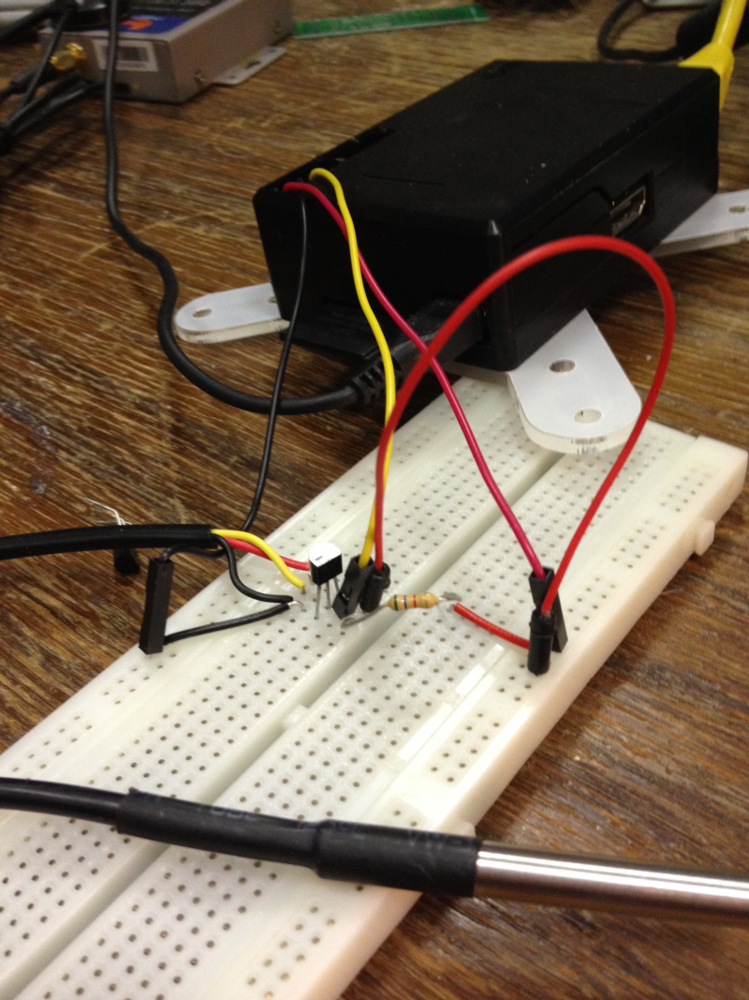

# Wire1 (1-wire) Level II driver

**Available for**: Linux (Kernel v2.6.29+)

1-Wire sensors especially the [DS18B20](https://datasheets.maximintegrated.com/en/ds/DS18B20.pdf) temperature sensor is extremely popular in the hobby community for it's ease of use. Also the possibility to have many sensors connected on one 1-wire bus is a big plus for this sensor.

The wire1 driver is built to take advantage of the 1-wire support that is available in the Linux kernel from version 2.6.29.

This driver reports temperature from any number of DS18B20 temperature sensors connected to a Linux system. The reported event is [CLASS1.MEASUREMENT, Type=6 temperature](http://docs.vscp.org/spec/latest/#/./class1.measurement#type6).

**Driver Linux**: vscpl2_wire1.so

The configuration string has the following format

    NumberOfSensors

##### NumberOfSensors

The parameter *NumberOfSensors* (which is optional) is the number of sensors the driver should report data from. This value can also be available as a VSCP daemon variable and if both are present the VSCP daemon variable will be used. Default is 1. 

 | Variable name    | Type    | Description  | 
 | -------------    | ----    | -----------  | 
 | _numberofsensors | integer | NumberOfSensors is the number of sensors the driver should report data from. | 
 | _path[0..n]      | string  | Path to the lm-sensor data file.  | 
 | _guid[0..n]      | guid    | GUID to use when the data for the sensor is reported.  If no GUID is used the reserved GUID for 1-wire with the unique id for the sensor will be used. | 
 | _interval[0..n]  | integer | Sample interval in seconds for events. Default is 30 seconds. | 
 | _unit[0..n]      | integer | Unit use. Allowed values 0=Kelvin,1=Celsius or 2=Fahrenheit. Default is 2 (Celsius).  | 
 | _index[0..n]     | integer | Measurement index 0-7. Default is 0. | 
 | _coding[0..n]    | integer | Message coding 0-2. Default is 0. Allowed values 0=Normalized integer, 1=string, 2=floating point. | 

The full variable name is built from the name you give the driver (prefix before _variablename) in vscpd.conf. So in the examples below the driver have the name **wire1** and the full variable name for the **_numberofsensors** will thus be

    wire11_numberofsensors

If you have another diver and name it  **wire2** it will therefore instead request variable **wire2_numberofsensors**

If your driver name contains spaces, for example “name of driver” it will get a prefix that is “name_of_driver”. Leading and trailing spaces will be removed. 

##### Example of vscpd.conf entry for the wire1 driver.

```xml
<driver enable="true" >
    <name>wire1</name>
    <path>/usr/local/lib/vscpl2_wire1.so</path>
    <config>2</config>
    <guid>00:00:00:00:00:00:00:00:00:00:00:00:00:00:00:00</guid>
</driver>
```

Example for variable configuration. In this sample the temperature from two DS18B20 temperature sensors is reported every ten seconds.

```xml
<!-- ******************************************************** -->
<!--            VSCP wire1 Level II driver variables     -->
<!-- ******************************************************** -->
<!-- Number of sensors to read -->
<variable type="int" >
	<name>wire1_numberofsensors</name>          	
	<value>2</value>      
</variable>

<!-- ******************************************************** -->
<!--           Variables for temperature sensor 1        -->
<!-- ******************************************************** -->

<!-- Interval for temperature reports -->
<variable type="int" >
	<name>wire1_interval0</name>          	
	<value>10</value>      
</variable>

<!-- VSCP GUID -->
<!-- We use the automatically generated GUID 
     (1-wire guid + sensor id)  -->

<!-- Path to sensor data file for sensor 1 -->
<variable type="string" >
<name>`wire1_path0`</name>
<value>`/sys/bus/w1/devices/28-00000548476b/w1_slave`</value>
</variable>


<!-- ******************************************************** -->
<!--           Variables for temperature sensor 2        -->
<!-- ******************************************************** -->

<!-- Interval for temperature sensor 2 -->
<variable type="int" >
	<name>wire1_interval1</name>          	
	<value>10</value>      
</variable>

<!-- VSCP GUID -->
<!-- We use the automatically generated GUID 
     (1-wire GUID + sensor id)  --> 	

<!-- Path to sensor data file for sensor 2 -->
<variable type="string" >	
	<name>wire1_path1</name>          	
	<value>/sys/bus/w1/devices/28-000003e71198/w1_slave</value>      
</variable>

```


----

# Using the Level II wire1 driver

The 1-wiew support is yet quite limited on Linux systems and at the moment only memory and temperature devices are really supported. The wire1 driver currently just support temperature readings.

## Loading the kernel driver

**Info**

*  https://www.kernel.org/doc/Documentation/w1/w1.generic
*  How to configure - https://how-to.wikia.com/wiki/How_to_configure_the_Linux_kernel/drivers/w1

For the 1-wire subsystem to support you need to first add a master driver for the 1-wire bus. Popular is the now discontinued DS2490 USB adapter. To get a working system reading temperatures if you have this device you need to load the needed modules

    modprob ds2490
    modprob w1-term

If you have some other interface than DS2490 search for which driver to use. 

If you have a Raspberry Pi you can instead use GPIO4 (pin 7) which have support for 1-Wire. You have to add a 4k7 pull up resistor to 3.3V yourself.

On the latest kernel builds on Raspberry Pi you need to add "dtoverlay=w1-gpio" to /boot/config.txt for any of this to work! 

To get it all working

    modprob w1-gpio
    modprob w1_therm

After this is done temperature sensor will be visible in the folder */sys/bus/w1/devices* 

The id will start with the [1-wire family code](https://github.com/owfs/owfs-doc/wiki/1Wire-Device-List) which is **10** for 18S20 and **28** for 18B20.)

For exampel

    /sys/bus/w1/devices/10-00080192afa8/w1_slave

Will show have a file content of where t=4937 is the temperature * 1000

    0a 00 4b 46 ff ff 0d 10 79 : crc=79 YES
    0a 00 4b 46 ff ff 0d 10 79 t=4937 

This is the file that is read by the wire1 driver and sent to the VSCP subsystem.

You way want to add the modules to **/etc/modules** so that they load automatically the next time you start your system.

# Hooking up a Ds18B20 to Raspberry Pi



On this picture a standard DS18B20 and a water proof sensor with a DS18B20 is connected to the Raspberry Pi. The connection is very easy.


*  Fetch power from pin 1 - 3.3V

*  Fetch ground from pin 6.

*  The reserved 1-Wire pin is GPIO4 which is on pin 4.

A good pin out diagram can be found here 

Click to see in full size.

A wiring diagram is here 

Note the 4k7 pullup that should be connected from 3.3V to the data line of the sensor.

To be complete we include the DS18B20 pin out also


[filename](./bottom_copyright.md ':include')
