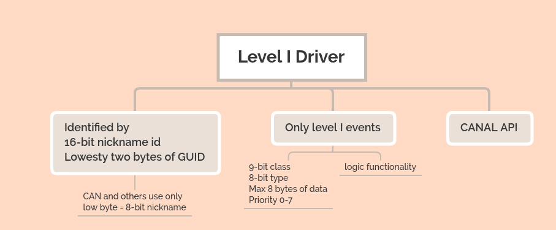

# VSCP Daemon Level I Drivers



This driver type is also called **CANAL** (CAN Abstraction Layer) drivers after the driver API they use. Most of them have no relation to [CAN](https://sv.wikipedia.org/wiki/Controller_Area_Network) other than the CANAL API which is used as a least common denominator allowing this type of driver handle many types of busses and devices.

The driver is just a shared library,  a .dll (Windows) or a .so (Linux) file with the Level I/CANAL interface exported. The CANAL interface is described [here](https://docs.vscp.org/canal/latest/#/). 

Many ready to use Level I drivers are available for VSCP & Friends. A list of drivers can be found [here](https://docs.vscp.org/#level1drv). Documentation, usage and install instructions can be found by going to each drivers repository.

The good thing with the Level I interface is that you can add the .dll or .so as a driver for use with the VSCP daemon or use the dll/so directly from your own application such as in [VSCP Works](https://docs.vscp.org/#vscpworks).

The drivers to use with the VSCP daemon is configured in the vscpd.json file ([format for the configuration](./configuring_the_vscp_daemon.md#config-drivers)). 

To make your own Level I driver just create a dynamically linked library that export the CANAL interface. There are plenty of examples to use as a starting point for creating your own driver in the [source tree for the VSCP & Friends package at GitHub](https://github.com/grodansparadis?tab=repositories&q=vscpl1drv&type=&language=). 

For Python developers [python-can](https://python-can.readthedocs.io/en/master/) is a good tool. __Unfortunately__ the CANAL interface is named USB2CAN here but it is there.

## Add and configure a driver

Go to the repository for the driver and download it and install it.

The configuration for a typical VSCP driver in the vscpd.json file looks like this

```json
{
  "enable" : false,
  "name" : "can4vscp",
  "config" : "/dev/ttyUSB0",
  "flags" : 0,
  "translation" : 2,
  "path" : "/var/lib/vscp/drivers/level1/vscpl1drv-can4vscp.so",
  "guid" : "FF:FF:FF:FF:FF:FF:FF:F5:01:00:00:00:00:00:00:02",

  "mqtt" : {
        ...
  }
}
```

The settings for the above is documented is in the [configuration section](./configuring_the_vscp_daemon.md#config-level1-driver). 

 
[filename](./bottom_copyright.md ':include')
