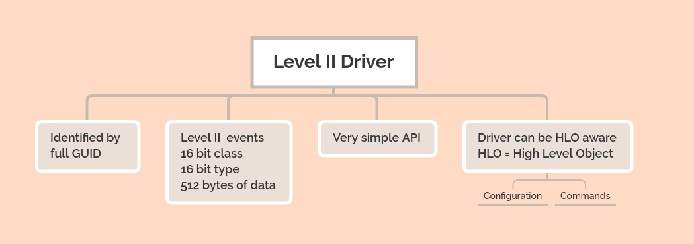

# Level II Drivers



Level II drivers are extremely simple API drivers that can be used to extend the VSCP server capabilities and be used as an alternative driver approach (as of level I drivers) for devices. They can connect to different type of hardware or logical functionality. Level II drivers has two advantages over Level I drivers. 

*  They always use the Level II event format which means that the full GUID is used. 

*  They can interface the daemon through the full MQTT interface using HLO giving a lot of possibilities for the driver to interact with the daemon and the world.

The ability to use the full GUID is good as there is no need for translation schema's between the actual GUID and GUID's used in interfaces. The GUID is unique all over the world.

Letting the driver talk to the daemon over the MQTT interface is favorable in that it can do many things that previously has been impossible. The most exciting is that it can read and write variables. This is the recommended way to use for configurations of a Level II driver. It means that configuration of all drivers can be made in one place (the daemon variable file), it gives a possibility to change run time values in real time etc.

The level II driver is, just as the Level I driver, a shared library, a .dll (Windows) or a .so (Linux), with a specific set of exported methods. The exported methods are four of the methods from the CANAL interface and uses identical calling parameters and return values. There are some differences however noted below. 

## Add and configure a driver

Go to the repository for the driver and download it and install it.

The configuration for a typical VSCP driver in the vscpd.json file looks like this

```json
{
    "enable" : false,
    "name" : "tcpiplink",
    "path-driver" : "/var/lib/vscp/drivers/level2/vscpl2drv-tcpiplink.so",
    "path-config" : "/var/lib/vscp/vscpd/tcpiplink.conf",
    "guid" : "FF:FF:FF:FF:FF:FF:FF:F5:09:00:00:00:00:00:00:00",
    "mqtt" : {
        ...
    }
}
```

The settings for the above is documented is in the [configuration section](./configuring_the_vscp_daemon.md#config-level2-driver). 

The driver configuration file is documented in it's own documentation.


## Creating your own driver
To make a Level II driver just create a dynamically linked library that export the Level II interface (described below). There are plenty of examples to use as a starting point for creating your own driver. Use one of the divers [here](https://docs.vscp.org/#level2drv) as your starting point.


## VSCP Level II API

## VSCPOpen

```c
long VSCPOpen( const char *pPathConfig,
                  const char *pguid);
```

Start the driver and give it some initial configuration data which itself reads from the configuration file. The supplied guid must be unique.

### pPathConfig
Path to a configuration file. Usually this file is in JSON or XML format but the driver maker can freely do this select a configuration file format.

### pguid
Pointer to a unique GUID.

### return
A handle to the opened interface.


## VSCPClose

```c
int VSCPClose( long handle );
```
Close a driver interface.

### handle
A valid handle received from a successful call to VSCPOpen.

### return
VSCP_ERROR_SUCCESS if successful otherwise one of the error codes defined in [vscp.h](https://github.com/grodansparadis/vscp/blob/master/src/vscp/common/vscp.h)

## VSCPWrite

```c
int VSCPBlockingSend( long handle, 
                        const vscpEvent *pEvent, 
                        unsigned long timeout );
```


Send an event while blocking for 'timeout' milliseconds (forever if timeout=0). 

### handle
A valid handle received from a successful call to VSCPOpen.

### pEvent
A pointer to a VSCP event as defined in [vscp.h](https://github.com/grodansparadis/vscp/blob/master/src/vscp/common/vscp.h). The driver copies the event so the caller is free to reuse the memory after the call.

### timeout
Time to block in milliseconds if the event can't be sent. If timeout is set to zero it should block for ever.

### return
VSCP_ERROR_SUCCESS if successful otherwise one of the error codes defined in [vscp.h](https://github.com/grodansparadis/vscp/blob/master/src/vscp/common/vscp.h)

## VSCPBlockingReceive

```c
int VSCPBlockingReceive( long handle, 
                           vscpEvent *pEvent, 
                           unsigned long timeout );
```


Blocking receive of an event. Blocks for 'timeout' milliseconds and forever if timeout=0. 

### handle
A valid handle received from a successful call to VSCPOpen.

### pEvent
A pointer to a VSCP event as defined in [vscp.h](https://github.com/grodansparadis/vscp/blob/master/src/vscp/common/vscp.h). The receiver is responsible for allocating and freeing the event.

### timeout
Time to block in milliseconds if no event is received. If timeout is set to zero it should block for ever.

### return
VSCP_ERROR_SUCCESS if successful otherwise one of the error codes defined in [vscp.h](https://github.com/grodansparadis/vscp/blob/master/src/vscp/common/vscp.h)

## VSCPGetVersion

```c
unsigned long VSCPGetVersion( void ) 
```

Fetch the version of the driver.

### return
The version of the driver as an unsigned long. The returned value is backed as 

```c
unsigned long ver = MAJOR_VERSION << 24 |
                        MINOR_VERSION << 16 |
                        RELEASE_VERSION << 8 |
                        BUILD_VERSION;
```


[filename](./bottom_copyright.md ':include')

