# Your first look at VSCP & Friends

OK your VSCP & Friends installation is waiting on the disk and you want to take it for a test ride. You have five minutes before other things in life must be attended to and here we are trying to convince you not to uninstall the system again. **OK here we go**.   

----

## Start the VSCP daemon

The absolute first thing you should do is to start the VSCP daemon. The VSCP daemon is the workhorse in most VSCP systems. You can live well without it but it's a piece of software well worth getting to know.


### Start the VSCP Daemon on Unix/Linux

Just issue

    vscpd -s

to run the daemon as a standalone program. The normal is that it is executed in the background. If you want to start the VSC daemon in the background issu

    /etc/init.d/vscpd start

You may need to make sure that you don't have double copies running by issuing

    sudo ps aux | grep vscpd


After starting the VSCP daemon you should see something like this

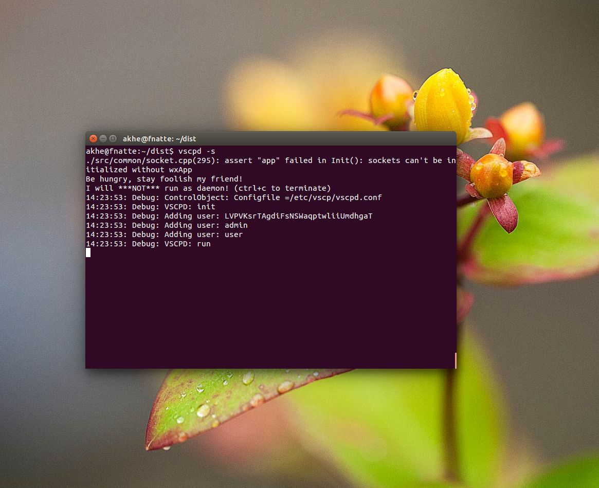


### Start the VSCP daemon on Windows

Just select the **VSCP daemon** under **VSCP & Friends** in the program menu. 

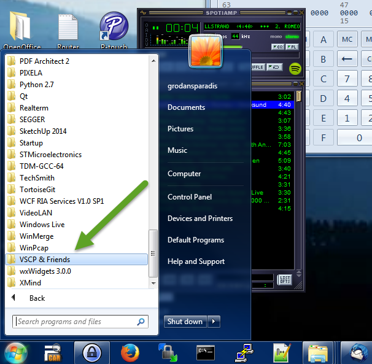


when the VSCP Daemon is running you will have a window like this one on your screen

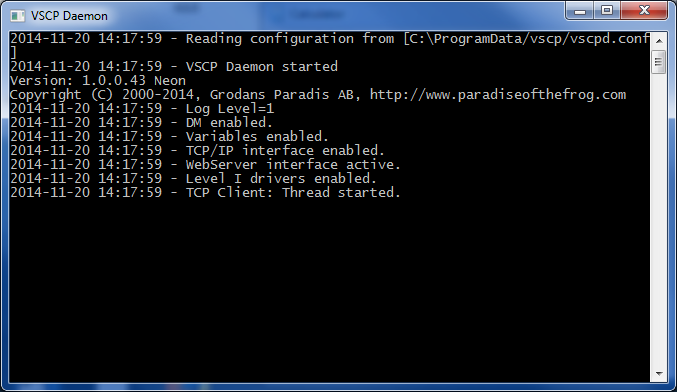}

When you have a system that you use in daily use the service version of the VSCP Daemon is a better choice as it runs in the background. But initially the standalone version can be better as you get more debug information from it.

## The TCP/IP control interface

[The TCP/IP control interface](./tcp_ip_control_interface.md) is the oldest interface of the VSCP daemon. It allows you to do many things, send and receive events for example. If you have an application that you need interface this is one interface you can chose for that. The [REST interface](./rest_interface.md) or the [websocket interface](./websocket_interface.md) or to build a [driver](./driver_interfaces.md)  is other options for that of course.

You can [configuration the TCP/IP](./configuring_the_vscp_daemon.md#tcpif) for use with SSL och ordinary Telnet. The default is a Telnet interface that listens on port 9598. You also have the option to disable the interface.

Now connect to the interface

    telnet localhost 9598

will do that on Linux machines. On windows telnet is not enabled as default and you have to turn it on in the Windows feature in the control panel 

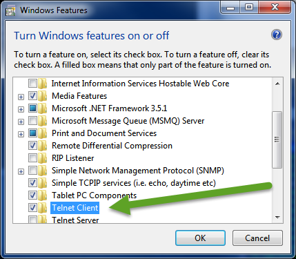

or use download and use [PuTTY](https://www.putty.org/)  


When connected to the TCP/IP interface you will see something like

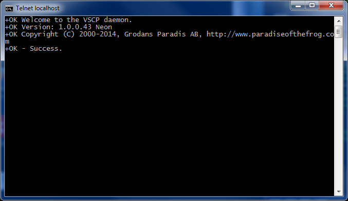

You will not be able to do much here without a username and password. Pn a freshly installed system the user name i "admin" and the password is "secret". Needless to say this is something you should change. So login into the tcp/ip interface by writing 

    user admin

and hitting return and then 

    pass secret

and hitting return. This screen shows the result you should expect

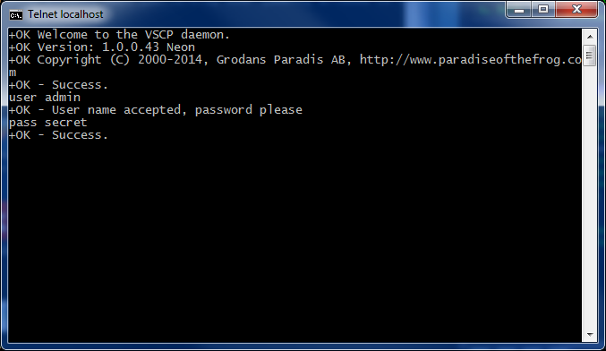

You may be thrown out of the system at this stage even if you give the correct credentials. This is due to the configuration settings for the admin user. In the distribution the admin account is setup like this

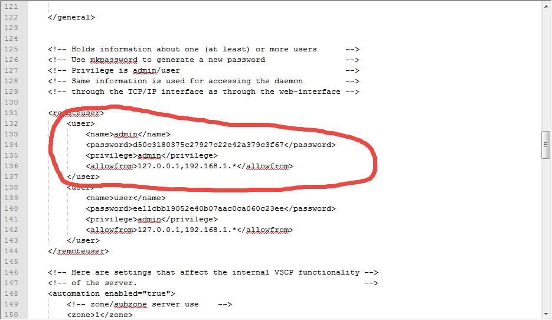

This says the username is "admin". Password is "secret" on this server. The user have admin-rights and the user is allowed to connect from "127.0.0.1,192.168.1.*". If you can't connect even if you give the correct username/password pair this may be the problem. This comma separated list tells from which remote hosts this user is allowed to connect. In this case from the localhost and from any host on network "192.168.1.0". So if you try to connect from a host not on any of these you will not be allowed to do so. If so change the host list or add your host and restart the VSCP daemon. Wildcards is allowed here so *.*.*.* will let everyone connect. **NOT GOOD!**

btw you find the mentioned configuration file **vscp.conf** in the folder /etc/vscp on Linux and in \ProgramData\vscp on windows.

    HELP 

can be a good command to start with. You can read all about the TCP/IP interface and what you can do [here](./tcp_ip_control_interface.md).

Before you start to develop your own interface code for this interface you should know that it is available in the [helper library](http://www.vscp.org/docs/vscphelper/doku.php?id=start). 

Now leave the telnet window open.

## The Administrative interface

You can administer many things over an integrated web-interface of the VSCP Daemon. You reach this interface at

    http://host:8884/vscp

typically

    http://localhost:8884

if you are on the same machine as the VSCP daemon is run on.  Again you have to login and the same credentials as for the TCP/IP interface applies here here to **User: admin and Pass: secret** and again you have to connect from an allowed host. The deafult is a standard http port but you can enable SSL if needed.

When you are connected and loged in you see something like

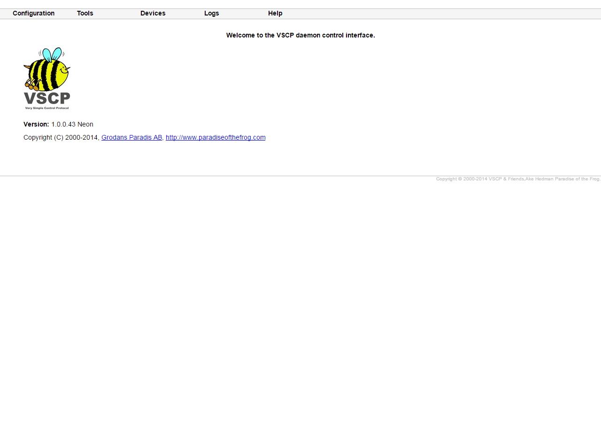

### Variables

Under 

    Configuration/Configuration file

you can see the configuration settings for your VSCP daemon.  

Under 

    Configuration/Variable List

you will get a list of variables that looks like this

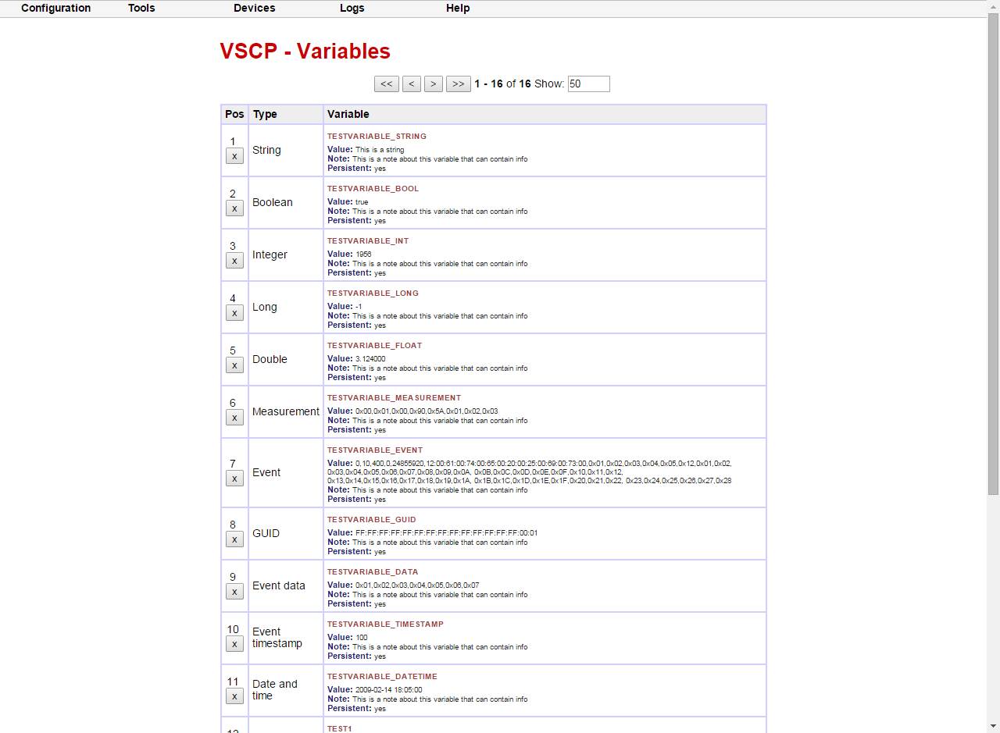  

----

and if you click on one of the lines yo can edit the settings for a variable.

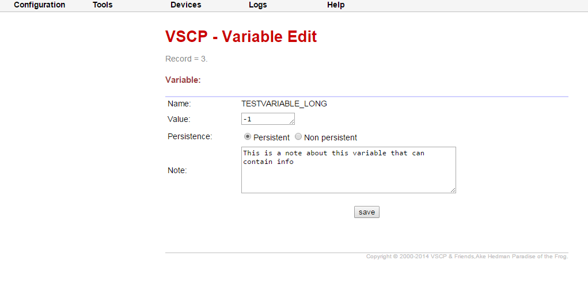

Variables are typed storage on the VSCP daemon that can be persistent or not. A typical usage of a variable is to store a value in for later use, a temperature from a sensor for example. This value can then be fetched from other parts of a system for calculations or display. This is especially good when an app is starting up and can fetch the latest value a sensor sent instead of needing to ask the sensor for it.

Some dummy variables is installed in the distributed system. You can delete them by editing the **variables.xml** file that is found in the configuration folder or deleting the in the administrative interface.
    
You can read everything about variables [here](./remote_variables.md).  


### The Decision Matrix

The decision matrix is a very powerful system that let you decide "what should happen when things happens". For example when a measurement is received form a sensor you can decide to store it in a remote MySQL database and also store it in a variable and also store it in a local table. But you can also do things "every hour", when the sun rise at your location etc etc.

The Decision matrix list look like this

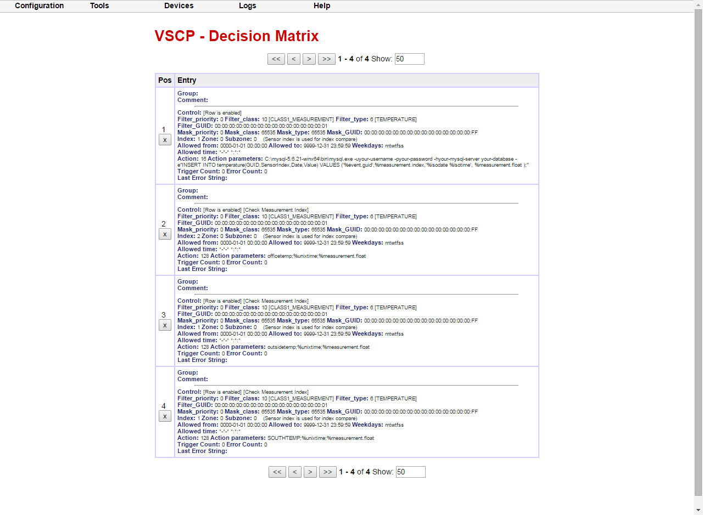

In this case the first entry log temperature data to a remote MySQL database and the three following log data to local tables. The MySQL logging is from an example described [here](./decision_matrix_example_database_mysql.md).

Also here you can edit DM entries by clicking on them

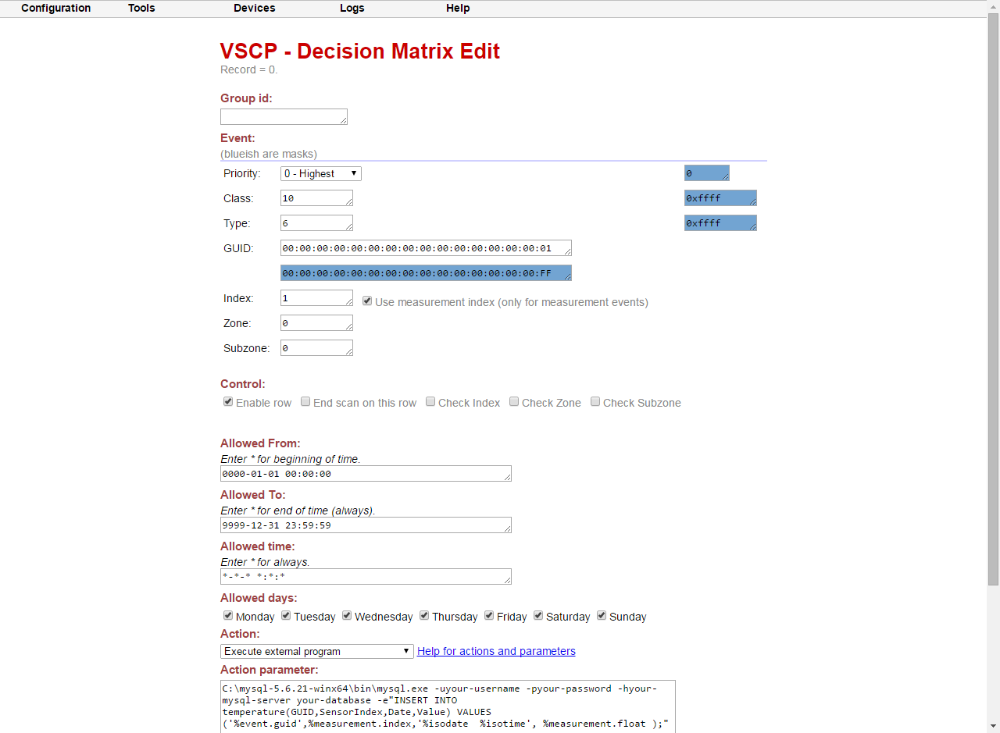

or add new DM rows. You can read all about the Decision Matrix [here](./decision_matrix.md).

### Interfaces

The VSCP daemon connects to the world through it's interfaces. You have a different interfaces and under

   Devices/Interfaces

you can get a current list that looks something like this

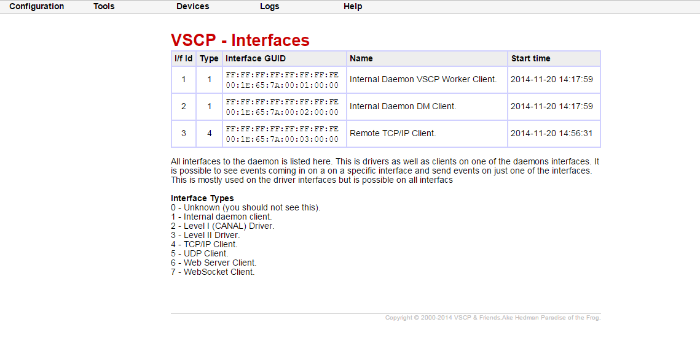

The **Remote TCP/IP Client** for example in this list is the TCP/IP clinet we connected above. Some others will always be in the list and [drivers](./driver_interfaces.md) will be added to this list also when they are enabled. If you want you can add a driver. Skip to next part if this is not of interest

##### Adding and enabling the logger driver

There are two drivers available for logging. One for Level I and one for Level II. You can think of Level II as used for more capable hardware with more memory and resources and Level I for low end hardware. We will enable the [Level II logger driver](./level2_driver_logger.md) here.

 1.  First stop the daemon. One or more **ctrl+c** will do that.
 2.  Then open the vscpd.conf file in an editor. You find it under /ProgramData/vscp on windows or /srv/vscp on Linux/Unix.
 3.  Now move down to the line that looks something like this

```xml	
<!-- Level II Logger  -->
<driver enable="false" >
	<name>VSCPLoggerDriver1</name>
	<path>vscpl2_loggerdrv.dll</path>
	<config>C:\tmp/vscp_level2.log</config>
	<guid>00:00:00:00:00:00:00:00:00:00:00:00:00:00:00:00</guid>
</driver>
```

Change the line

```xml
<driver enable="false" >
```

to

```xml
<driver enable="true" >
```

to enable the driver. The set the path to it. This will probably be

    C:\Program Files (x86)\VSCP\drivers\level2\vscpl2_loggerdrv.dll      

on a windows system and

    /usr/local/lib/vscpl2_loggerdrv.dll

on a Linux/Unix system.

The path tells where the logging file should be created. Set it to a path of your choice where you have write permissions.

Now save the file and start the VSCP Daemon again.

The VSCP Daemon will show that it started the driver

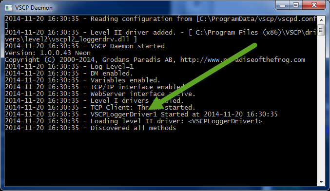

Now incoming events is stored in the file you specify for later inspection. There are several options available and you can read all about them in the [documentation](./level2_driver_logger.md). You can start as many logger drivers as you like (as for all drivers) with different properties. 

### Viewing Log files

You can view log files on the disk of course. You find them under

    \ProgramData\vscp\logs

on windows and under

    /srv/vscp/logs

on Linux/Unix. You can also view log files in the administrative web interfaces. 

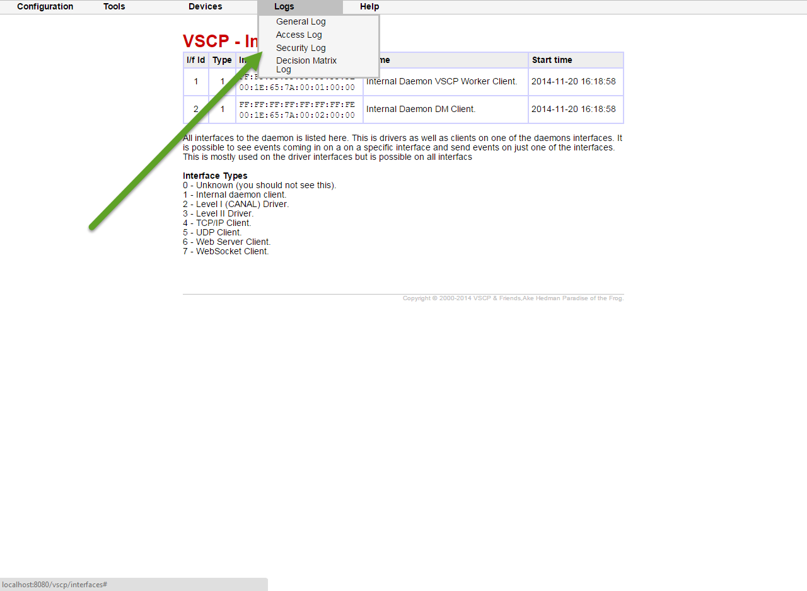

Convenient if you are examining a remote system.

### Tables

You can also view tables in the web interface. First as a list

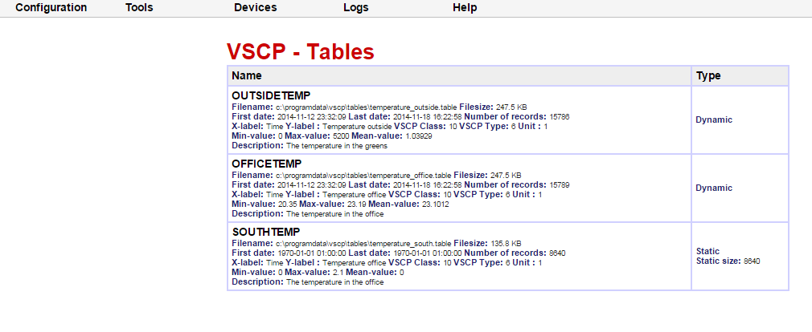

where the type of table is shown with data and statistics for the table. A dynamic table will grow for ever and a static table have a fixed size and will fill values in that table in a round-robin fashion.

If you click on a table you can view it's content

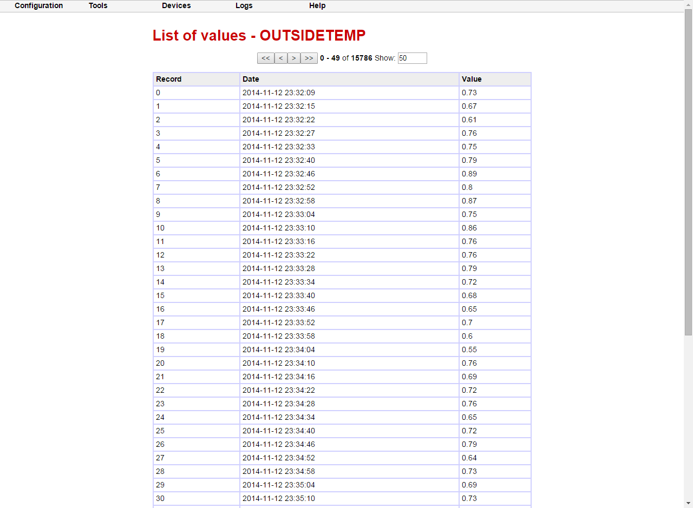

You can fetch table data in the [REST interface](./rest_interface.md), the [TCP/IP interface](./tcp_ip_control_interface.md) and in the [websocket interface](./websocket_interface.md). See the websocket section for examples.


## The websocket interface

The websocket interface is a very powerful interface for interfacing VSCP to web-applications including apps. on phones and tablet. It can of course be used by other applications that use websockets to, such as **node.js** or similar.

The initial installation of VSCP & Friends on both Linux/Unix and Windows installs the [VSCP HTML5 sub project](https:///github.com/grodansparadis/vscp_html5) under the web servers root path. This is

    /srv/vscp/web

on a Linux/Unix system and

    /ProgramData/vscp/web

on a Windows system. 

As this part of the system is evolving very fast at the moment the source in the distribution may be older than the current source at github so you may want to download the [current source](https://github.com/grodansparadis/vscp_html5/archive/master.zip) and unpack it in the web root folder when you start to work with this on a more than test basis. 

The code here is based around the [vscpwslib.js](https://github.com/grodansparadis/vscp_html5/blob/master/lib/vscpwslib.js) which is a javascript library which handles the interfacing with the VSCP Daemon. You find this file in the lib-folder under the webservers root. It is not minimized yet because it is not officially released but you can of course do that yourself.

To reach the package open the url

    http://localhost:8884/index.html

(change the URL if you use another host or port). You will see this page

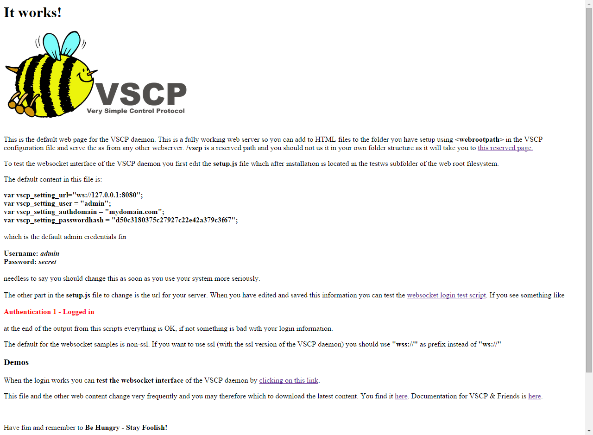

Read the text on this page carefully before you continue. The important thing is to edit the

    testws/settings.js

file so it works for your setup.  Username and password is the same as is used in the rest of the system (**User**:admin, **Password**:secret). And if you have not changed anything you should not need to edit anything except possible the host address if the VSCP Daemon is not on the same host as you run your browser on.

Now got to the

    testws/index.html

which will show this page

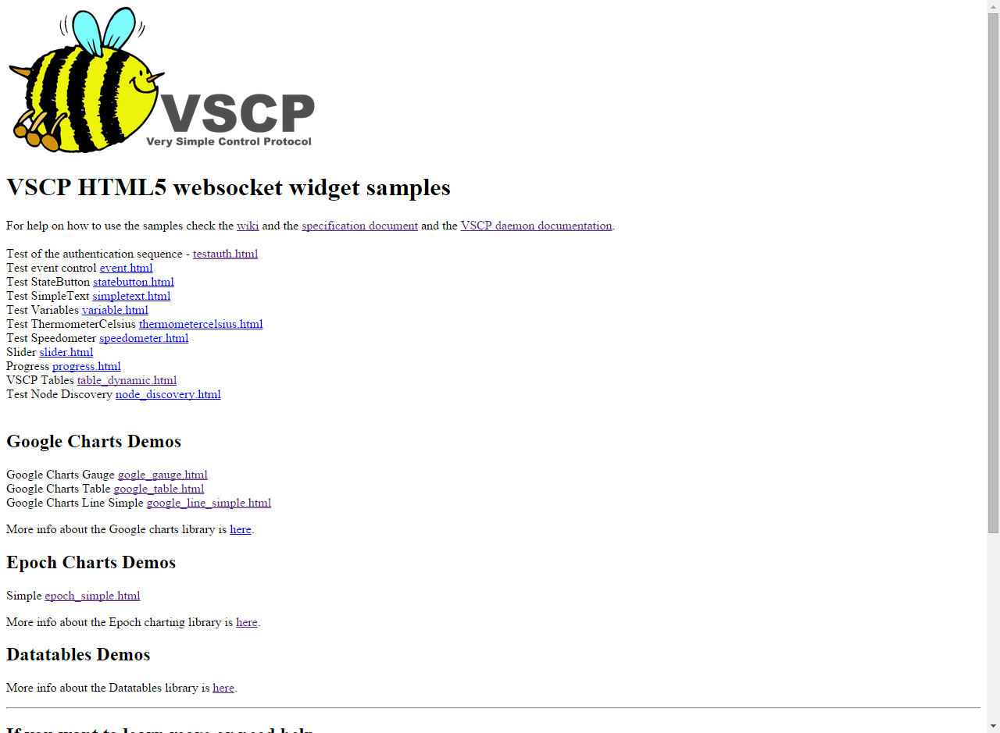

now click on the testauth on this page

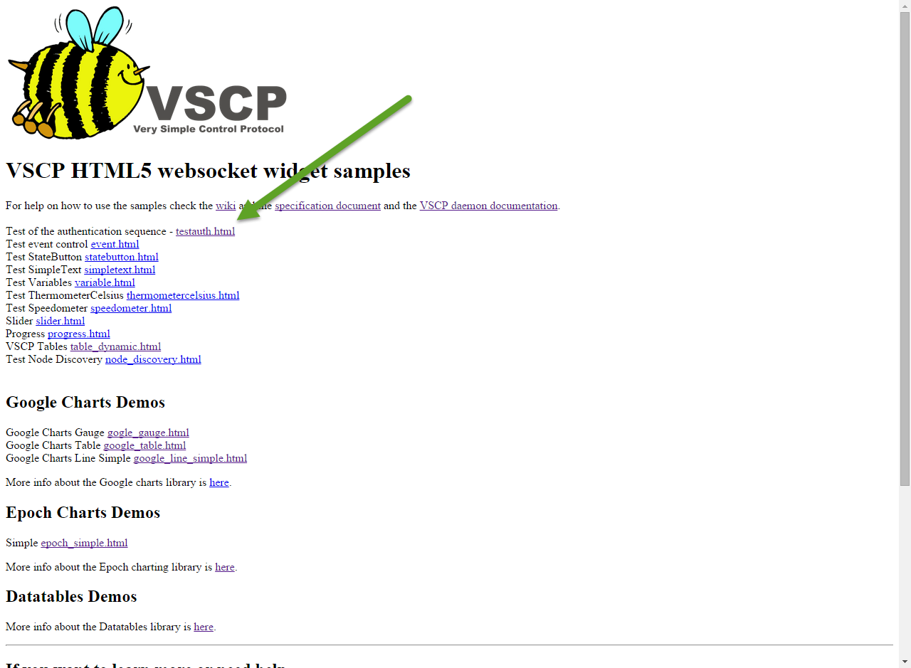

this test shows if the authentication works OK. It's a must for the rest of the samples to work. You will see something like this if it works 

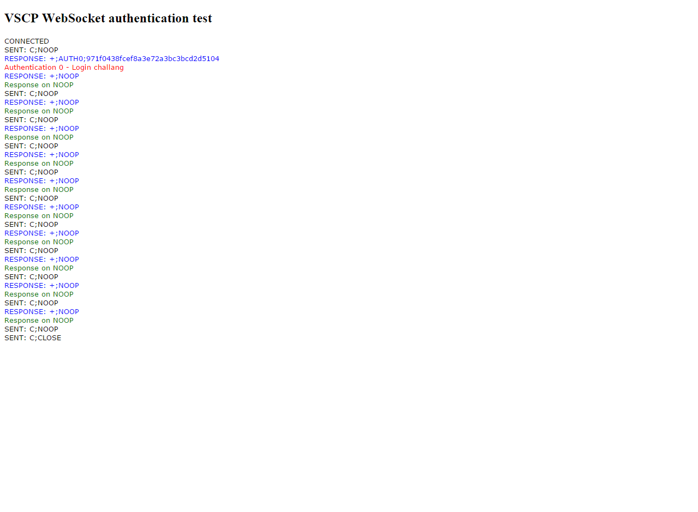
    
If it does not work try to refresh the page and if it does not still work read the  part about [user credentials settings for the TCP/IP interface above](#the_tcp_ip_control_interface).  

If it works you are now ready to test the websocket system. Most of the pages here is self explanatory but I will still walk you threw some examples here to make the connections between the different system parts we discussed so far clear.

It may be good to have the JavaScript console open in your browser when you test the samples to spot errors early.  
    
### Sending events and more

Events is a central thing for VSCP. There are many, many events defined and the number grows all the time. A typical event is the [Turn-On event](http://docs.vscp.org/spec/latest/#/./class1.control?id=type5-0x05-turnon) which switch something on. When Turn-on is sent by something in a VSCP system it normally expects the switching device to respond with an [On event](http://docs.vscp.org/spec/latest/#/./class1.information?id=type3-0x03-on). 

Events belong to a **class** and have a **type** and use some data. The above events is normally is written **CLASS1.CONTROL, Type=5, TurnOn**  and the responding event is written **CLASS1.INFORMATION, Type=3, ON**. You can read all about this [the VSCP specification](http://docs.vscp.org/spec/latest/#).

So lets test the On-Event. Open the page

    http://localhost:8884/testws/statebutton.html

the page should look like this

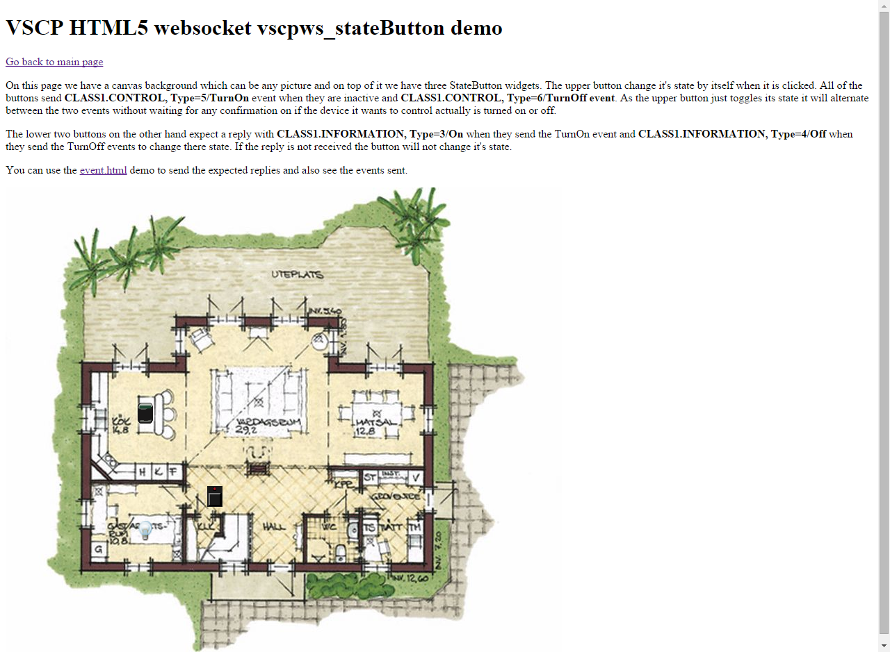

If no connected to the VSCP daemon websocket interface can be established or if it goes down the buttons will look like this

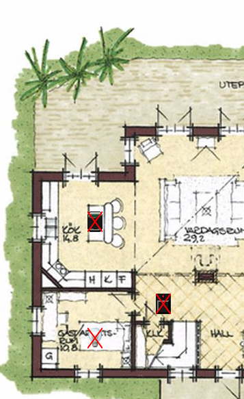

Let the state button test page be in one window/tab of a browser and open the

    http://localhost:8884/testws/event.html


in another browser window/tab.  Scroll down so that you see Demo 5 of on the last page.  

Now press one of the buttons in the State Button page and investigate what is received in the event page. If everything works you should see something like this

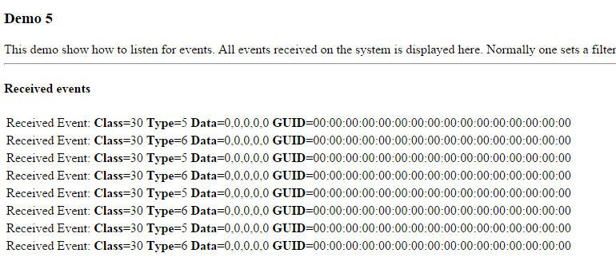

Here I have pressed the upper left button several times and what you see in the event window is **CLASS1.CONTROL, Type=5, TurnOn** and **CLASS1.CONTROL, Type=6, TurnOff** events being receive. You may also notice that if you press any of the lower two buttons they does not seem to react but if you look in the event window you see that they do. They only send **CLASS1.CONTROL, Type=5, TurnOn** as here

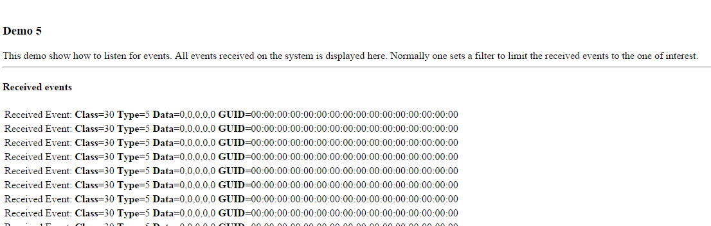

and the button never change it's visual indication as the top button does

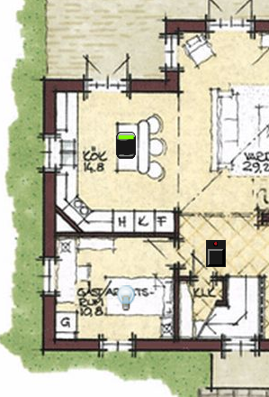

This is because they send **CLASS1.CONTROL, Type=5, TurnOn** when pressed but does not change its apperance until they receive a **CLASS1.INFORMATION, Type=3, ON** or **CLASS1.INFORMATION, Type=4, OFF** for that matter. In demo 2 of the event page you can send these

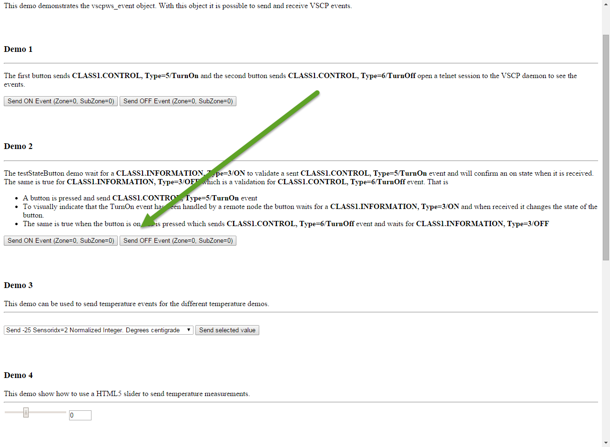

and all buttons will go into there visual on-state.

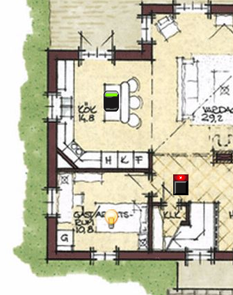

Hopefully you left the telnet window open that you opened previously. If you did't open a new window and press some of the buttons a few times. If you issume the command

    chkdata
 
in the telnet window you will see how many events that are waiting in the input queue for the telnet session you have open. In my case it looks like this

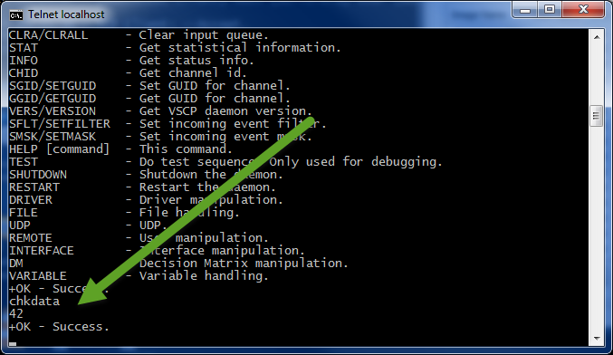

As you see I have 42 events waiting for me. I can receive them with the

    retr

command giving the number of events I want to read as an argument. This give me

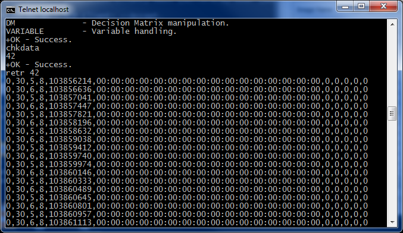

Instead of polling for events you can use the command

    rcvloop

which will receive events until you quit it with **quitloop**

As the buttons are activated when they receive **CLASS1.INFORMATION, Type=3** On you can send it to them from the TCP/IP interface. Just send

    send 0,20,3,0,,,-,0,0,0

and to turn them off

    send 0,20,4,0,,,-,0,0,0

For the the upper button there also is a variable test. It constantly check the value of the boolean variable **stateButton1** on the VSCP Daemon and and change state according to it. So lets create this variable. Go to the administration interface and create the variable

    http://localhost:8884/vscp/varnew

and step 1 make it boolean

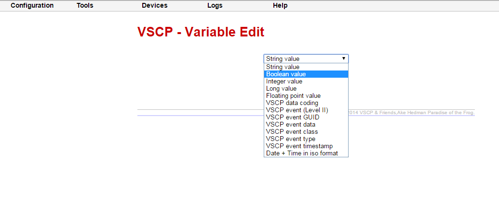

and step 2 give the variable a name and set it as not persistent

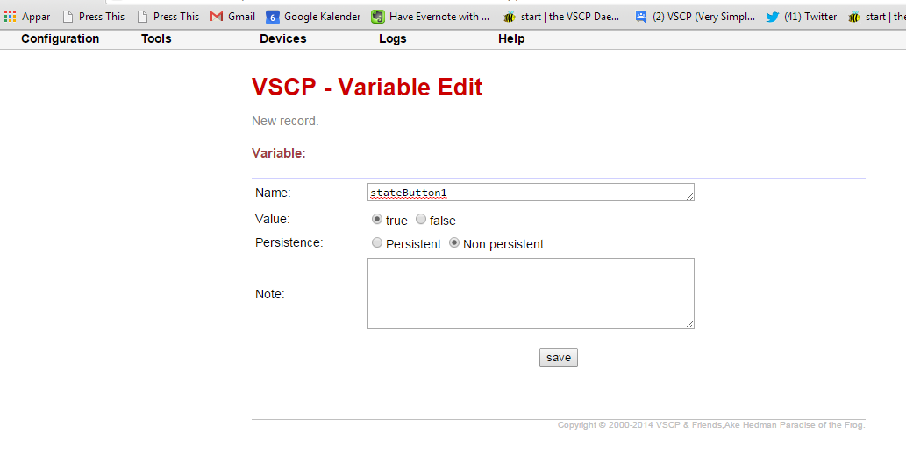

if you click on the button you will see that the variable **StatButton1** also will change its state. Refresh the page to see the change.  This also works the other way around so changing the variable valuer will change the button value.


### Show temperature

There is a widget available that makes it easy to show temperatures. You find a test under

    http://localhost:8884/testws/thermometercelsius.html

that looks like this

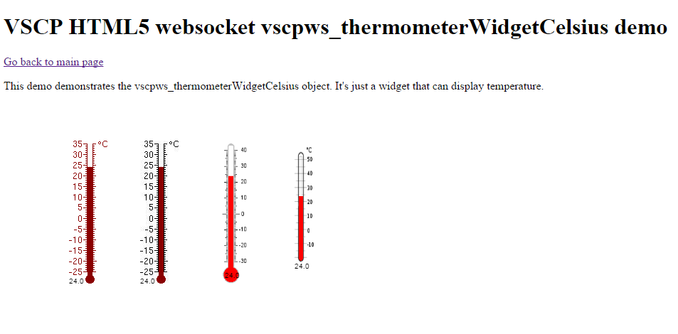  

you can use **demo 4** (the slider) of the event test page to set the temperature of the thermometers

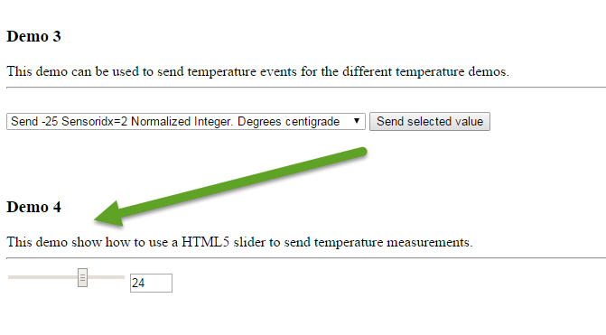

or **demo 3** which can set a couple of temperatures.

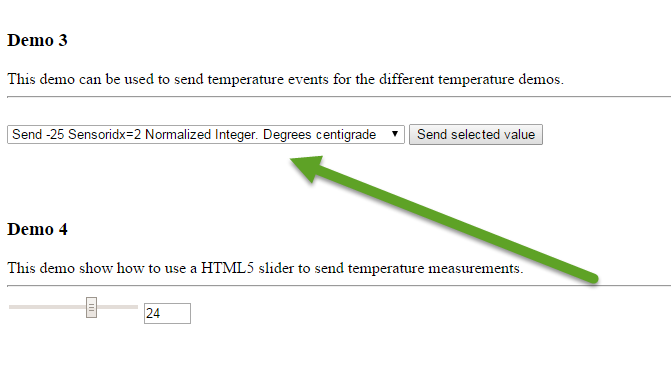

but of course you can send the temperature from a node connected to a driver, or through the TCP/IP interface 

    send 0,10,6,0,,,-,138,0,10

for 10 degrees Celsius or

    send 0,10,6,0,,,-,138,0,255
    
for -1 degree Celsius. 
 
And there is also the [REST interface](./rest_interface.md). 

While we at temperature you can also set temperature on the speedometer test page
    
    http://localhost:8884/testws/speedometer.html  
    
looks like this

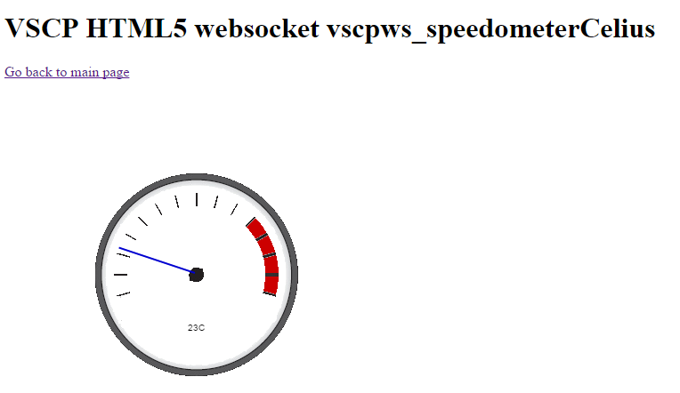

the Google Gauge looks much nicer of course. You find a testpage for it here  
    
    http://localhost:8884/testws/google_gauge.html

and it looks like this

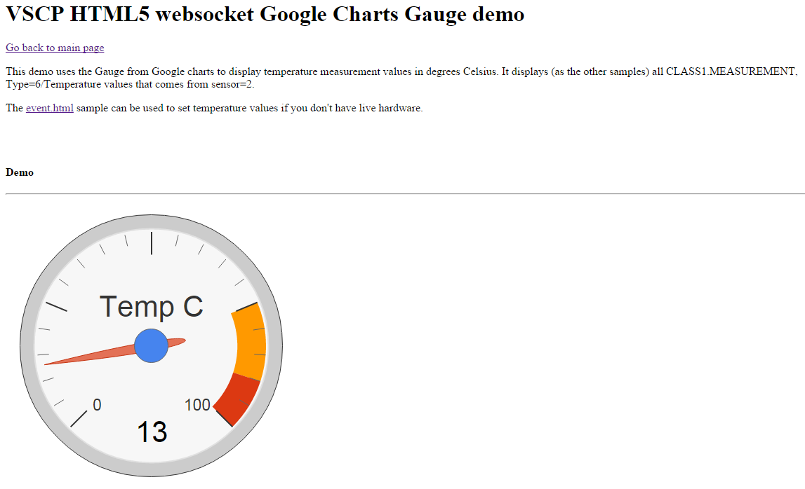

if you rather want to display the temperature in free text check the

    http://localhost:8884/testws/simpletext.html
    
and it looks like this

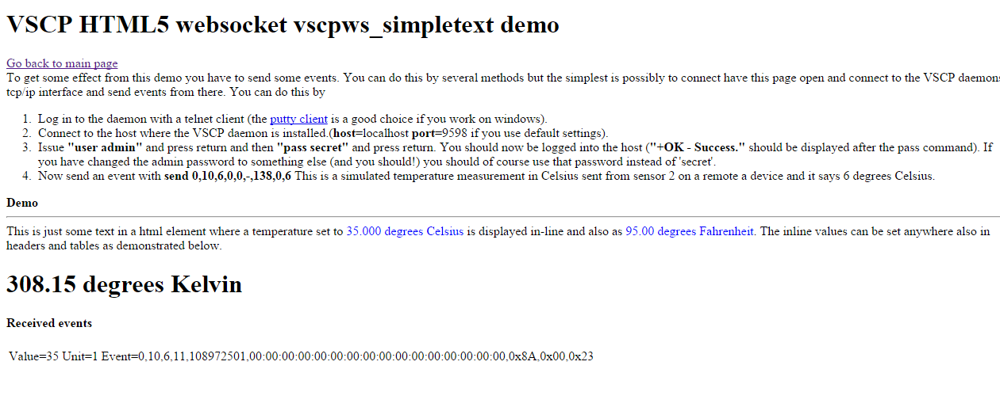

or maybe a table is better then check this

    http://localhost:8884/testws/google_table.html

which looks like this

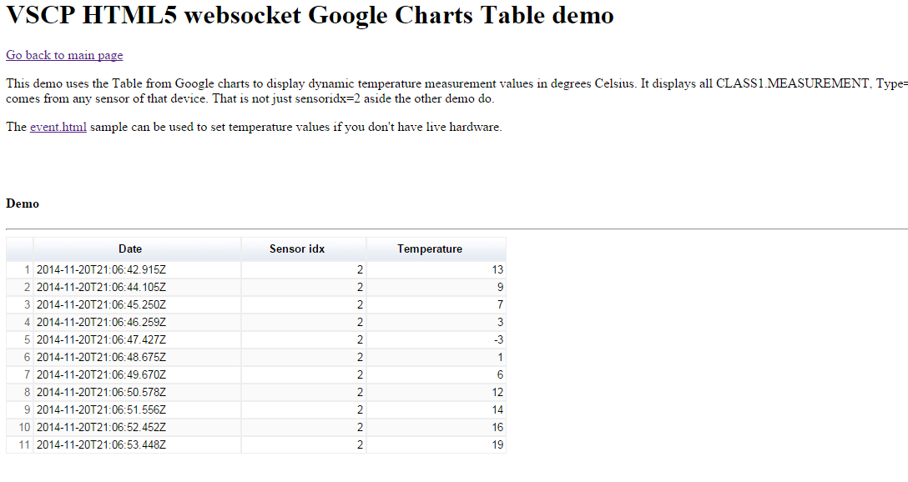

Or maybe you want the temperature displayed in a dynamic diagram. Then use

    http://localhost:8884/testws/google_line_simple.html

which looks like

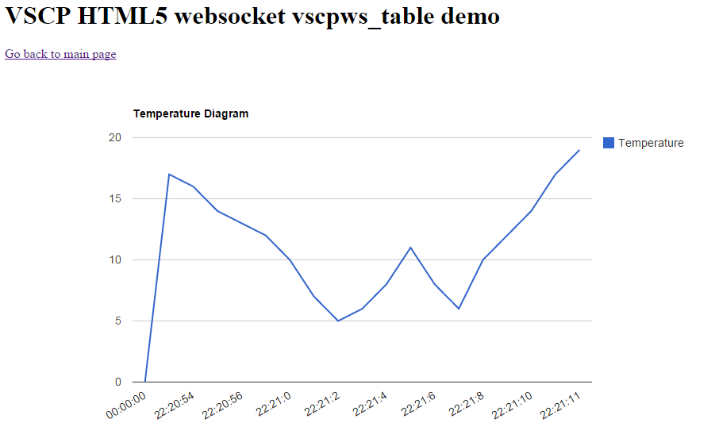


**oh well....**  
the five minutes is up. There is plenty of possibilities and either you uninstall now or investigate the possibilities. I will not even try to convince you in any way. But I may continue this walk through some day.

Cheers
/Ake 
    
[filename](./bottom_copyright.md ':include')
