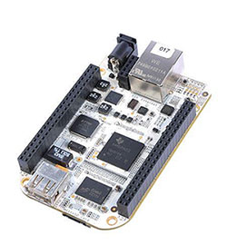

# Setting up the system on Beaglebone

[Beaglebone](https://beagleboard.org/bone) is a very nice board and VSCP & Friends is a perfect match for it if you are using distributions based on Debian wheezy or later.

VSCP & Friends has been tested and works very well on Beaglebone Black. The setup is the same as on other Unix systems so the instructions to [setup VSCP & Friends on a Unix system](./setting_up_the_system_on_unix.md) can be used.

## Related Links

*  opkg package manager - https://wiki.openwrt.org/doc/techref/opkg
*  Reflashing - http://circuitco.com/support/index.php?title=Updating_The_Software
*  Setting up CAN - https://github.com/digitalbond/canbus-beaglebone
*  Testing CAN - https://groups.google.com/forum/#!msg/beagleboard/MLJFSCh_J-w/fX1r6E_AvIoJ
* http://e2e.ti.com/support/arm/sitara_arm/f/791/t/154560.aspx?pi69795=2
*  Touch screen - http://www.carcomputer.co.uk/index.php?/monitors/hdmi-monitors/lilliput-fa1011-np/c/t-10.1-hdmi-touch-screen-monitor
*  

[filename](./bottom_copyright.md ':include')
 
